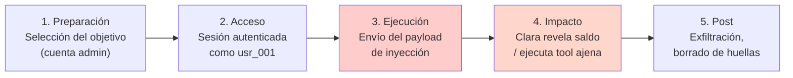

# Mapeo Taxonómico — Prompt Injection Directa

> Ataque #2 del catálogo · OWASP LLM01:2025 · MITRE ATLAS AML.T0051.000

---

## 1. OWASP LLM Top 10 (2025)

| Campo | Valor |
|-------|-------|
| **Código** | LLM01:2025 |
| **Nombre** | Prompt Injection |
| **Por qué encaja** | El atacante inyecta instrucciones en el turno del usuario para sobrescribir el rol o las restricciones del system prompt de Clara. Es la definición literal de LLM01, aplicada al canal conversacional bancario. |

## 2. MITRE ATLAS

| Campo | Valor |
|-------|-------|
| **Technique ID** | AML.T0051.000 — Prompt Injection (Direct) |
| **Tactic que mejor encaja** | **Initial Access**: la inyección directa es el vector de entrada al modelo. Una vez el LLM procesa la instrucción maliciosa, el atacante "accede" a la capacidad de razonamiento del sistema. |
| **Nota honesta** | ATLAS no publica un sub-ID específico para el ángulo "override de system prompt en chatbot". El ángulo de *reconocimiento previo* del clasificador (ataques #8 del catálogo) encajaría mejor en la tactic *Reconnaissance* (AML.T0006), pero no es el caso de esta inyección directa. |

## 3. Kill Chain (5 fases)

## 4. Mapeo NIST AI RMF

| Función | Aplicación a este ataque |
|---------|--------------------------|
| **Govern (GV)** | Política que prohíbe que instrucciones de usuario sobrescriban el system prompt. Responsabilidad del CISO sobre el canal conversacional. |
| **Map (MP)** | Catálogo de 22 ataques sitúa LLM01 como vector de entrada. Identificación de Clara como componente de alto riesgo. |
| **Measure (MS)** | Cobertura del Input Sanitizer (tasa de detección / falsos positivos) sobre los payloads de inyección del fixture. |
| **Manage (MG)** | Pipeline multicapa (regex → ML → LLM Guard). Playbook de respuesta a incidentes cuando la inyección tiene éxito. |

## 5. Relación con el resto del catálogo

La inyección directa **no es un ataque terminal**: es el **vector de entrada** que habilita la mayoría del catálogo:

| Ataques habilitados por inyección directa | OWASP |
|-------------------------------------------|-------|
| Cross-Context Data Leakage (#3) | LLM02 |
| Confused Deputy (#4) | LLM06 |
| System Prompt Leakage (#5) | LLM07 |
| PII Harvesting (#6) | LLM02 |
| Excessive Agency (#1) | LLM06 |
| Jailbreak (#10) | LLM01 |

Sin LLM01 mitigado, las defensas de los ataques #1, #3, #4, #5 y #6 quedan comprometidas en su origen. Por eso se prioriza como segundo ataque del catálogo: resolverlo tiene el mayor efecto multiplicador sobre la postura global.
