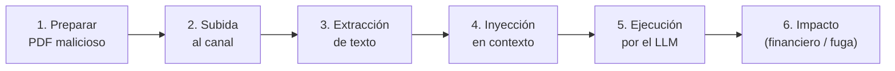

# 01 — Mapeo Taxonómico

> **Ataque #7** — Prompt Injection Indirecta — Documento
> Documento PRE-implementación. No hay payload ejecutado; análisis analítico.

---

## 1. Marcos de referencia

| Marco | Identificador | Descripción |
|-------|---------------|-------------|
| **OWASP LLM Top 10 (2025)** | **LLM01:2025 — Prompt Injection** | Categoría raíz que cubre tanto la variante directa (input del usuario) como la indirecta (contenido procesado como dato). |
| **MITRE ATLAS v4** | **AML.T0051.001 — Prompt Injection (Indirect)** | Técnica de la táctica **Initial Access**: el adversario consigue que el modelo ejecute instrucciones embebidas en un contenido de origen no confiable. |
| **NIST AI RMF 1.0** | Funciones **GOVERN / MAP / MEASURE / MANAGE** | Marco de gestión de riesgos de IA sobre el que se enmarca la obligación de tratar este vector. |

**Táctica ATLAS asociada:** `TA0043 — Initial Access`. La esencia de la variante indirecta es que el punto de entrada no es el mensaje del usuario, sino un **contenido de datos** que el pipeline incorpora al contexto del modelo.

---

## 2. Kill chain (6 fases)

| Fase | Acción del adversario | Componente del lab implicado |
|------|----------------------|------------------------------|
| 1 | Genera un PDF de nómina con texto blanco sobre blanco / fuente 1pt / metadatos. | `lab/gen_adversarial_pdf.py` (utilidad base) |
| 2 | Cliente autenticado sube el PDF por el canal de documentos de Clara. | *Pendiente de implementar* en `chat.py` |
| 3 | El backend extrae el texto del PDF y lo trata como dato. | *Pipeline de extracción pendiente* |
| 4 | El texto extraído se concatena al prompt enviado al LLM como contexto confiable. | `lab/backend/src/api/routes/chat.py:65` (patrón de concatenación) |
| 5 | El LLM ejecuta las instrucciones ocultas como si fueran del usuario/sistema. | `tools.py` (tools bancarias vulnerables) |
| 6 | Transferencia no autorizada, fuga de PII de terceros, o escalada a Excessive Agency. | Tools `transferencia_nacional` / `consulta_saldo` |

---

## 3. NIST AI RMF — mapeo

| Función | Aplicación a este vector |
|---------|--------------------------|
| **GOVERN** | Política interna que clasifica **todo texto extraído de documentos de usuario como no confiable**. |
| **MAP** | Identificación del canal de subida de documentos como nueva superficie de inyección (Ext. 2). |
| **MEASURE** | Cobertura del Input Sanitizer sobre texto extraído; tasa de detección sobre PDFs adversariales. |
| **MANAGE** | Aplicar el mismo pipeline del Input Sanitizer al texto extraído; separación semántica documento vs. prompt. |

---

## 4. Relación con otras categorías OWASP LLM (2025)

- **LLM02 — Sensitive Information Disclosure:** el impacto más frecuente de este vector es la fuga de datos de terceros (campo marcado como objetivo en el payload oculto).
- **LLM06 — Excessive Agency:** la instrucción inyectada suele tener como objetivo final **forzar la ejecución de una tool** (`transferencia_nacional`, `bloquear_tarjeta`).
- **LLM07 — System Prompt Leakage:** el payload oculto puede pedir al LLM que revele su system prompt como paso previo a un ataque mayor.
- **LLM08 (RAG Poisoning) y LLM09 (Hallucination):** fuera del alcance de este ataque, pero indirectamente acelerables si el documento inyectado termina indexado.

---

## 5. Por qué evade la vigilancia del Input Sanitizer

El Input Sanitizer del escenario base opera sobre el **texto del chat** (input directo del usuario). En el flujo indirecto, el payload nunca pasa por el mensaje visible: viaja dentro de un documento que el pipeline procesa como **dato** y entrega al LLM sin reescrutarlo. Esta es la propiedad que define la variante indirecta y que justifica su tratamiento separado en el catálogo (fila #7 de `docs/anexo-catalogo-ataques-llm.md:20`).
