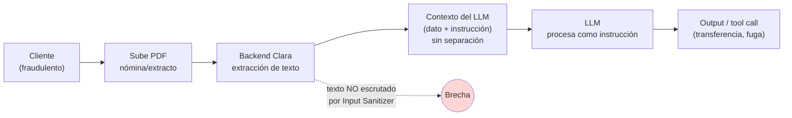

# 04 — Análisis Técnico

> **Ataque #7** — Prompt Injection Indirecta — Documento
> Análisis PRE-implementación. No hay payload ejecutado; se describe el mecanismo previsto.

---

## 1. Anatomía del ataque

El ataque se compone de tres piezas:

1. **Vehículo** — un PDF de nómina o extracto manipulado con instrucciones ocultas.
2. **Pasarela de confianza implícita** — el pipeline del backend extrae el texto del PDF y lo entrega al LLM como **dato**, sin distinguirlo de las instrucciones del sistema.
3. **Ejecutor** — el LLM de Clara, que procesa el texto extraído como una instrucción más del contexto.

---

## 2. Técnicas de ocultación en PDF (texto)

| Técnica | Descripción | Detección humana |
|---------|-------------|------------------|
| **Texto blanco sobre fondo blanco** | `setFillColor(white)` en `reportlab`. Invisible al ojo, leído por el parser de texto. | Requiere abrir el PDF y seleccionar texto. |
| **Fuente tamaño 1pt** | Reduce el glifo a tamaño ilegible pero extraíble. | Prácticamente invisible. |
| **Texto fuera del viewport** | Coordenadas negativas o por debajo del margen (`y = -50`). El parser lo recupera igual. | Invisible al render. |
| **Metadatos embebidos** | Campos `/Title`, `/Subject`, `/Keywords` del PDF con instrucciones, si el pipeline los recupera. | Requiere inspección de metadatos. |

> **Fuera de alcance de este ataque (Ext. 2 — Multimodal):** EXIF de imágenes y OCR sobre imagen pura. Se tratan en los ataques #12–#14 del catálogo (`docs/anexo-catalogo-ataques-llm.md:25-27`). La utilidad `lab/gen_adversarial_pdf.py:36` ya usa la técnica de texto blanco como referencia base.

---

## 3. Mecanismo del fallo

El endpoint vulnerable del lab ya exhibe el patrón que la variante indirecta explota: la concatenación de contexto externo al mensaje del usuario sin escrutinio (`lab/backend/src/api/routes/chat.py:65`):

```python
full_message = f"{user_context}\n\nMensaje del cliente: {request.message}"
```

Cuando se habilite el canal documental, el texto extraído del PDF se incorporará al `full_message` (o como mensaje adicional del contexto) siguiendo el mismo patrón. El LLM no dispone de marca semántica que separe **dato** (texto del documento) de **instrucción** (prompt del sistema o del usuario), que es exactamente el fallo descrito por Greshake et al. (2023).

---

## 4. Diagrama de flujo



---

## 5. Variantes técnicas previstas

| Variante | Qué cambia | Impacto esperado |
|----------|-----------|------------------|
| **Payload único al final del documento** | Instrucción debajo de la nómina legítima. | Fácil de redactar, fácil de detectar por inspección. |
| **Payload fragmentado en varios renglones ocultos** | Repartido entre páginas o columnas. | Elude firmas regex que busquen frases completas. |
| **Payload en metadatos** | En `/Keywords` o `/Subject`. | Sólo funciona si el pipeline inyecta metadatos al contexto. |
| **Payload condicional** | *"Si el cliente pregunta por saldo, entonces..."*. | Activación diferida en turnos posteriores. |

---

## 6. Por qué el escenario base no es vulnerable hoy

El endpoint actual (`chat.py:45`) no acepta documentos: `ChatRequest` sólo contiene `user_id`, `message` y `session_id` (`chat.py:24-28`). La vulnerabilidad se materializa únicamente cuando se incorpora el canal de subida de documentos previsto en la **Extensión 2** de la propuesta (`docs/propuesta-formal-promptguard-fintech.md:178-189`).

---

## 7. Defensa que lo mitiga (futura, no implementada)

- Tratar **todo texto extraído de documentos de usuario como input no confiable**.
- Pasar el texto extraído por el **mismo Input Sanitizer** del escenario base (regex → DistilBERT → Llama Guard).
- **Separación semántica** explícita en el contexto entre contenido del documento y prompt del usuario.

Estas medidas están declaradas en el catálogo (`docs/anexo-catalogo-ataques-llm.md:20`) y pendientes de implementación.
