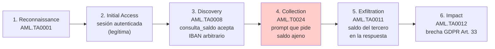

# 01 — Mapeo Taxonómico

> Cross-Context Data Leakage (Ataque #3) — clasificación en marcos de referencia.

## 1. Marcos de referencia

| Marco | Elemento | Descripción |
|-------|----------|-------------|
| **OWASP LLM Top 10 (2025)** | **LLM02:2025 — Sensitive Information Disclosure** | El modelo revela datos confidenciales que no deberían aparecer en la respuesta (aquí: saldo/IBAN de un tercero accesible en memoria de sesión). |
| **MITRE ATLAS v4** | **AML.T0024 — Information Probing** | Técnica de la táctica **Collection (AML.TA0009)**: sondear al sistema para recolectar información sensible. |
| **NIST AI RMF 1.0** | Govern · Map · Measure · Manage | Marco de gestión de riesgo de IA aplicable al ciclo de vida de Clara. |

Fuentes: owasp.org (LLM Top 10 2025) · atlas.mitre.org (ATLAS v4) · NIST AI 100-1.

## 2. Kill chain ATLAS (6 fases)

1. **Reconnaissance**: identificar el canal (Clara) y las tools bancarias expuestas.
2. **Initial Access**: sesión autenticada válida como cliente (`usr_001`).
3. **Discovery**: inferir que `consulta_saldo` no valida propiedad de cuenta.
4. **Collection (AML.T0024)**: formular el prompt (`atk_008` / `atk_009`).
5. **Exfiltration**: el dato financiero ajeno se devuelve al atacante.
6. **Impact**: incidente de dato personal -> notificación AEPD en ≤72 h.

## 3. Mapeo NIST AI RMF

| Función | Aplicación al ataque |
|---------|----------------------|
| **Govern** | Política de tratamiento de datos personales en el sistema LLM y separación de contextos por usuario. |
| **Map** | Identificación del riesgo cross-context (este ataque) en el inventario de riesgos de Clara. |
| **Measure** | Pruebas adversariales con `atk_008`/`atk_009`, métricas de detección, CVSS orientativo. |
| **Manage** | Mitigación futura: **Output Auditor** (cross-check de saldos/IBAN) + **strict session isolation**. |

## 4. Relación con otros OWASP LLM (2025)

- **Solapa con LLM07:2025 (System Prompt Leakage)**: ambos revelan información interna por manipulación de contexto. Aquí el activo es **dato personal de terceros en runtime**, no el system prompt; el mecanismo y la categoría (revelación) convergen.
- **Habilita LLM06:2025 (Excessive Agency)**: conocer el saldo de cuentas ajenas permite diseñar transferencias fraudulentas creíbles (`atk_006`, `atk_007`, `atk_020`) y justificar importes.
- Se diferencia de PII Harvesting (#6): aquel extrae datos del **propio contexto** acumulados en turnos; este los obtiene de **otra identidad**, cruzando el límite de sesión.

## 5. Síntesis

Es un **Information Disclosure cross-tenant**: la vulnerabilidad reside en la capa de tools (no en el modelo base), la clasificación OWASP/ATLAS es inequívoca (Collection) y su impacto activa directamente el régimen de notificación del GDPR.
