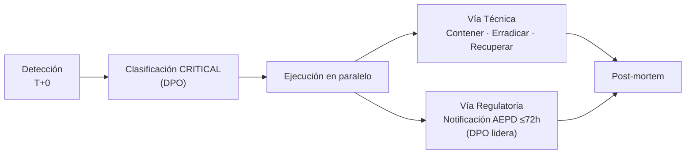

# 07 — Playbook de Respuesta a Incidentes

> Cross-Context Data Leakage (#3). Procedimiento con énfasis en el **reloj legal de 72 h** (GDPR Art. 33).

## 0. Principio rector

Toda detección de fuga de datos de un tercero vía Clara **inicia un reloj de 72 horas** para notificar a la AEPD. La respuesta técnica y la notificación regulatoria **van en paralelo**, no en secuencia.

## 1. Detección

| Canal | Estado | Descripción |
|-------|--------|-------------|
| **Output Auditor** (futuro) | Pendiente de implementar | Cross-check de IBAN/saldo en la respuesta vs. cuentas del `user_id` de sesión. Sería el detector primario. |
| Queja del cliente afectado | Operativo hoy | El titular denuncia haber visto su saldo expuesto o se detecta movimiento anómalo. |
| Revisión de logs del Compliance Logger | Operativo hoy | Inspección manual de `tools_used` con `account_id` ajeno al `user_id`. |

**Disparador:** cualquier respuesta de Clara que contenga saldo/IBAN de una cuenta que **no pertenece** al `user_id` autenticado (mapeo usuario↔cuenta en `lab/backend/src/models/banking.py:104-129`).

## 2. Clasificación

- **Severidad: CRITICAL** (motivo: **GDPR Art. 33** — brecha de dato personal con reloj legal).
- Criterios: dato financiero de tercero expuesto + accesibilidad confirmada del vector.
- Responsable de clasificar: **DPO**, en consulta con el SOC.

## 3. Respuesta — fases y reloj 72 h

| Fase | Acciones | Responsable | Meta temporal |
|------|----------|-------------|---------------|
| **Contención** | Bloquear/aislar `consulta_saldo`; congelar sesiones implicadas; pasar el proxy a modo *block* para ese vector. | SOC / Security Engineer | < 4 h |
| **Erradicación** | Parche de **validación de propiedad** `account_id` vs `user_id` (referencia futura: Tool Gatekeeper sobre `tools.py:32-36`). | Security Engineer | < 24 h |
| **Recuperación** | Reactivar la tool con control; rotar contexto/sesiones afectadas; verificar con `atk_008`/`atk_009` que ahora filtran `BLOCK`. | Security Engineer | < 36 h |
| **Notificación AEPD** (GDPR Art. 33) | Cumplimentar plantilla (`05-cumplimiento-normativo.md` §4) y enviar en ≤72 h. | **DPO (lidera)** | **≤ 72 h** |
| **Comunicación al interesado** (Art. 34) | Notificar al titular cuyo saldo se filtró, dado el alto riesgo del dato financiero. | DPO + Atención al cliente | Sin demora indebida |
| **Post-mortem** | RCA, lecciones aprendidas y actualización del registro de riesgos (EU AI Act Art. 9). | Security Engineer + DPO | ≤ 2 semanas |

## 4. Roles y responsabilidades (RACI resumido)

| Tarea | DPO | SOC Analyst | Security Eng. | CISO |
|-------|:---:|:-----------:|:-------------:|:----:|
| Clasificar severidad (GDPR) | **R/A** | C | I | I |
| Contención técnica | I | **R/A** | C | I |
| Parche (validación de propiedad) | I | C | **R/A** | I |
| Notificación AEPD ≤72 h | **R/A** | I | C | I |
| Comunicación al interesado | **R/A** | I | I | C |
| Post-mortem y registro de riesgos | C | C | **R** | A |

*R = Responsable · A = Aprobador · C = Consultado · I = Informado.*

## 5. Criterios de cierre

- [ ] Vector contenido y erradicado (verificado con `atk_008`/`atk_009` -> `BLOCK`).
- [ ] Notificación AEPD enviada dentro de las 72 h (acuse conservado).
- [ ] Interesado notificado (Art. 34).
- [ ] Post-mortem firmado por CISO y registro de riesgos actualizado.
- [ ] Defensa definitiva (Output Auditor + strict session isolation) registrada como trabajo futuro del TFM.
