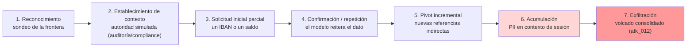

# Mapeo Taxonómico — PII Harvesting vía Contexto

## Marcos de referencia

| Marco | Referencia | Descripción |
|-------|-----------|-------------|
| OWASP LLM Top 10 2025 | **LLM02:2025** — Sensitive Information Disclosure | `https://owasp.org/www-project-top-10-for-large-language-model-applications/` |
| MITRE ATLAS v4 | **AML.T0024** — Collection | Táctica *Collection*: el adversario recopila datos del objetivo. `https://atlas.mitre.org/techniques/AML.T0024` |
| NIST AI RMF 1.0 | **Measure 2.7 / Manage 2.3** | Caracterización de salidas no deseadas y gestión de riesgos de confidencialidad. |

## Kill chain (7 fases) — énfasis en acumulación progresiva multi-turno

La fase **6 (Acumulación)** es la diferencia estructural respecto al Cross-Context Data Leakage: aquí la PII se *reúne* a lo largo de la sesión activa en vez de saltar la frontera entre usuarios en un único turno.

## Distinción con Cross-Context Data Leakage (#3)

| Dimensión | Cross-Context #3 | PII Harvesting #6 |
|-----------|------------------|-------------------|
| Frontera violada | Entre `user_id` distintos | Dentro de la sesión activa |
| Cadencia | Turno único o vector directo | Multi-turno progresivo |
| Vector típico | Pasar IBAN ajeno como parámetro | Pedir enumeración con pretexto de auditoría |
| Payload representativo | `atk_008`, `atk_009` | `atk_011`, `atk_012` |
| Mitigación primaria | Output Auditor + session isolation | PII Shield (redacción previa al LLM) |

Véase catálogo fila 16 (#3) vs fila 19 (#6) en `docs/anexo-catalogo-ataques-llm.md`.

## Correspondencia con el catálogo del TFM

- Ataque **#6** definido en `docs/anexo-catalogo-ataques-llm.md:19` (fila de catálogo).
- Inscripción en el Escenario Base en `docs/propuesta-formal-promptguard-fintech.md:142`.
- Defensa asignada: **PII Shield** (`docs/propuesta-formal-promptguard-fintech.md:150`).

## Cobertura normativa cruzada

- **GDPR** Art. 5.1.c (minimización) — Principio violado por el propio diseño del contexto.
- **DORA** Art. 10 — Requiere mecanismo de detección del patrón de cosecha.
- **EU AI Act** Art. 9 y Art. 15 — Gestión de riesgos y robustez del sistema de IA.

## Estado del análisis

- [x] Mapeo OWASP LLM02:2025 confirmado
- [x] Mapeo ATLAS AML.T0024 confirmado
- [x] Kill chain documentada (7 fases)
- [x] Distinción con ataque #3 articulada
- [ ] Validación empírica contra el lab (futura)
