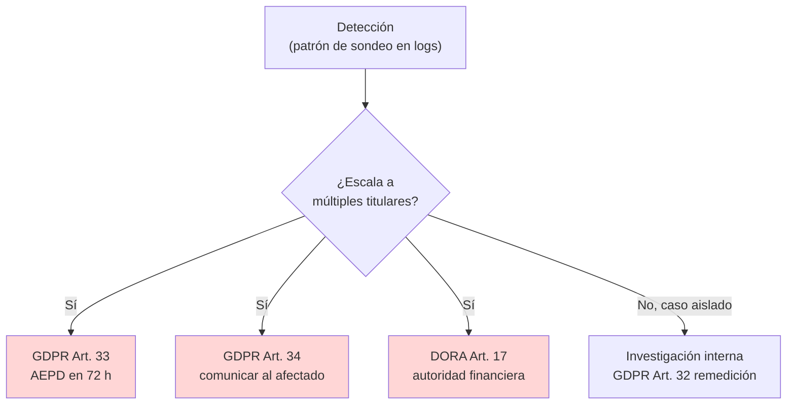

# Cumplimiento Normativo — PII Harvesting vía Contexto

> Artículos citados estrictamente de la lista permitida del TFM: GDPR (2016/679), DORA (UE 2022/2554), EU AI Act (2024/1689).

## 1. GDPR (Reglamento 2016/679)

| Artículo | Requisito | Aplicación al ataque #6 |
|----------|-----------|-------------------------|
| **Art. 5.1.c** — Principio de minimización | Datos adecuados, pertinentes y limitados a lo necesario | **Clave.** El contexto de Clara acumula PII de 4 titulares aunque el usuario autenticado solo precisaría la suya. La cosecha exitosa demuestra que el sistema retiene **más PII de la estrictamente necesaria**. |
| **Art. 32** — Seguridad del tratamiento | Medidas técnicas y organizativas apropiadas | Ausencia de PII Shield = ausencia de control técnico de redacción antes del LLM. Falta de minimización en el diseño del pipeline. |
| **Art. 33** — Notificación a la autoridad | Comunicar brecha a la AEPD en **72 h** | Si la cosecha escala a múltiples titulares (lab: 4 cuentas; producción: sectores de los 900.000 clientes), obligación de notificación **activada**. |
| **Art. 34** — Comunicación al interesado | Informar al afectado cuando riesgo alto | Riesgo alto (financiero + identidad) → comunicación individual a cada titular cosechado. |

**Umbral orientativo de activación de Art. 33/34:** la notificación se vuelve prácticamente obligatoria cuando el número de titulares afectados deja de ser trivial. En el lab, los 4 titulares mock ya representan el caso de "múltiples afectados".

## 2. DORA (Reglamento UE 2022/2554)

| Artículo | Requisito | Aplicación al ataque #6 |
|----------|-----------|-------------------------|
| **Art. 10** | Programa de respuesta a incidentes ICT con detección, gestión y notificación | Requiere mecanismo que detecte el **patrón de sondeo multi-turno** (no solo el evento individual). El Compliance Logger futuro debe alimentar esta detección. |
| **Art. 17** | Notificación de incidentes importantes a la autoridad competente | Si el incidente se clasifica como ICT mayor, encadena reporte al regulador financiero (Banco de España / EBA). |

> DORA Art. 6, 9, 11 se mencionan como marco del programa de gestión de riesgo ICT y de la protección/detección de amenazas, pero los dos artículos que se **activan directamente** ante una cosecha de PII son Art. 10 y Art. 17.

## 3. EU AI Act (Reglamento 2024/1689)

VerdaBank clasifica a Clara como sistema de IA de **alto riesgo** (scoring/acceso a servicios financieros) según `docs/propuesta-formal-promptguard-fintech.md:522`.

| Artículo | Requisito | Aplicación al ataque #6 |
|----------|-----------|-------------------------|
| **Art. 9** | Sistema de gestión de riesgos iterativo | El ataque #6 debe figurar en el registro de riesgos del proveedor/desplegador. La existencia del catálogo del TFM es evidencia de cumplimiento documental. |
| **Art. 15** | Exactitud, robustez y ciberseguridad | La capacidad de cosechar PII viola el requisito de robustez frente a manipulación del contexto. El PII Shield es la medida correctiva. |

> EU AI Act Art. 12 (trazabilidad), Art. 13 (transparencia) y Art. 14 (supervisión humana) son marco general del sistema; los que se materializan **directamente** ante #6 son Art. 9 y Art. 15.

## 4. Cadena de notificación (resumen)

## 5. Brechas documentales (evidencia para la memoria)

- [x] Mapeo Art. 5.1.c como artículo **clave** del ataque #6.
- [x] Umbral de notificación Art. 33/34 articulado por escala.
- [x] DORA Art. 10 y Art. 17 como obligaciones operativas.
- [x] EU AI Act Art. 9 y Art. 15 como obligaciones de diseño.
- [ ] Inclusión en el registro formal de riesgos del desplegador (futuro, post-implementación).
