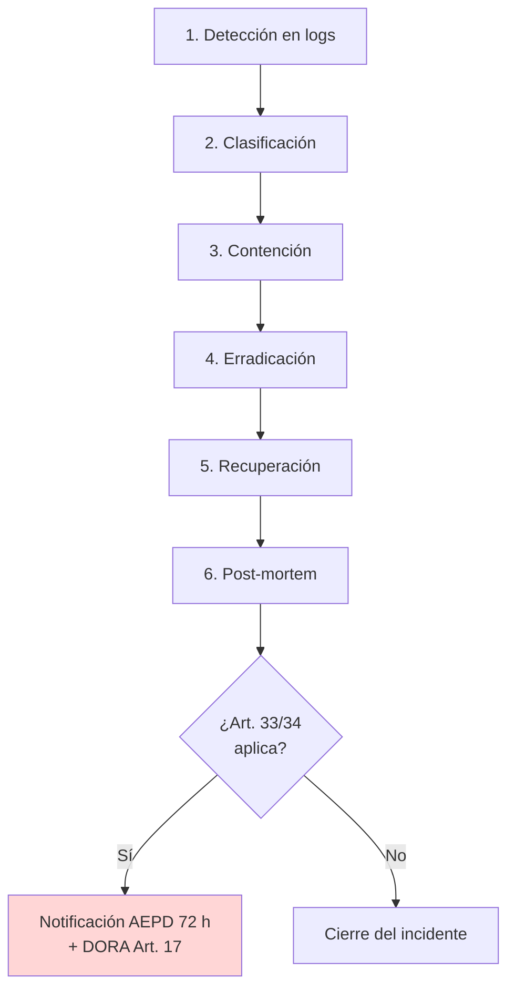

# Playbook de Respuesta a Incidentes — PII Harvesting vía Contexto

> Procedimiento alineado con GDPR Art. 33/34, DORA Art. 10/17 y el modelo de roles del LLM-SOC descrito en `docs/propuesta-formal-promptguard-fintech.md:421-504`.

## 1. Detección

**Patrón de sondeo en logs** que distingue la cosecha de una consulta legítima:

- [ ] ≥3 turnos en una misma `session_id` que invoquen `consulta_saldo` para cuentas **distintas** al `user_id` autenticado.
- [ ] Presencia de lexicon de pretexto: *"auditoría interna"`, *"compliance"`, *"reporte"`, *"verificar"` + enumeración.
- [ ] Coincidencia con firmas de `atk_011` / `atk_012` (`lab/backend/tests/fixtures/attack_prompts.jsonl:11-12`).
- [ ] Aparición de **≥2 IBANs** en el output de una sola sesión donde solo 1 debería figurar.

Fuente primaria de detección futura: **Compliance Logger** + **Attack Pattern Detector** (Ext.1, `docs/propuesta-formal-promptguard-fintech.md:174`). En el estado vulnerable actual, la detección es retrospectiva (revisión de logs).

## 2. Clasificación

| Severidad | Criterio | Acción |
|-----------|----------|--------|
| **CRITICAL** | Cosecha confirmada de ≥100 titulares o de cuenta admin (`ES58…1335`) | Escalado inmediato a CISO + activación Art. 33 |
| **HIGH** | Cosecha de 2-99 titulares | Escalado a SOC + Compliance Officer en 1 h |
| **MEDIUM** | Un titular no propio filtrado, caso aislado | Investigación interna, sin Art. 33 |

## 3. Contención

- [ ] Invalidar `session_id` del atacante (logout forzoso).
- [ ] Bloquear `user_id` si hay evidencia de intención fraudulenta.
- [ ] Activar **PII Shield** en modo bloqueo (si está disponible) o deshabilitar tools de lectura (`consulta_saldo`) temporalmente.
- [ ] Snapshot de los logs de la sesión afectada con firma HMAC (`docs/propuesta-formal-promptguard-fintech.md:153`).

## 4. Erradicación

- [ ] Patch del pipeline: integrar `redact_ibans` (`lab/backend/src/utils/iban.py:78-105`) y `redact_cards` (`lab/backend/src/utils/card.py:104-126`) antes de la llamada al LLM.
- [ ] Añadir redacción de `owner_name` y `balance` (no cubiertos por las utils actuales) → futuro NER bancario.
- [ ] Endurecer `_get_account` (`lab/backend/src/agents/tools.py:27-29`) para rechazar cualquier `account_id` ajeno al `user_id` autenticado (solapa con Tool Gatekeeper).
- [ ] Reglas declarativas adicionales en `config/rules/banking_patterns.yaml` para los pretextos *"auditoría interna"* y *"compliance"*.

## 5. Recuperación

- [ ] Verificar que los turnos posteriores de sesiones legítimas no ven PII residual en contexto.
- [ ] Reabrir el servicio de Clara de forma gradual (canary por % de tráfico).
- [ ] Confirmar métricas del dashboard (`docs/propuesta-formal-promptguard-fintech.md:494-503`): PII Redaction Rate al 100%, sin regresión de latencia p95.

## 6. Post-mortem

- [ ] Cronología turno a turno de la sesión (vista 5 del dashboard, `docs/propuesta-formal-promptguard-fintech.md:472-482`).
- [ ] Listado exacto de titulares afectados → base para Art. 34.
- [ ] Decisión documentada sobre activación de **GDPR Art. 33** (notificación AEPD 72 h) y **DORA Art. 17** (autoridad financiera).
- [ ] Lección aprendida registrada en el catálogo de riesgos EU AI Act Art. 9.
- [ ] Update de los fixtures `atk_011` / `atk_012` si el patrón evolucionó.

## 7. Roles y responsabilidades

| Rol | Responsabilidad en este incidente |
|-----|-----------------------------------|
| SOC Analyst | Detección, contención inicial, transcripción de la sesión |
| Security Engineer | Erradicación técnica (PII Shield + reglas), validación post-patch |
| Compliance Officer | Decisión Art. 33/34, redacción de notificación AEPD |
| CISO | Aprobación de comunicación externa y escalado DORA Art. 17 |
| Data Protection Officer (DPO) | Evaluación formal del riesgo a derechos de los afectados |

## Diagrama de flujo del playbook

## Estado del análisis

- [x] Fases de IR definidas (Detección → Post-mortem)
- [x] Roles asignados según el modelo LLM-SOC del TFM
- [x] Vínculo con normativas (GDPR Art. 33/34, DORA Art. 10/17) declarado
- [x] Causa raíz y remedio técnico referenciados al código
- [ ] Validación funcional del playbook en simulacro (futuro)
