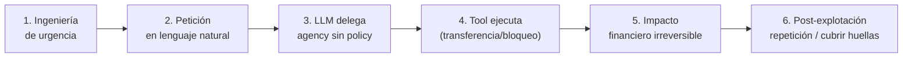

# 01 — Mapeo Taxonómico

> Ataque #1 del catálogo — **OWASP LLM06:2025 — Excessive Agency**
> Payloads: `atk_006`, `atk_007`, `atk_017` (`lab/backend/tests/fixtures/attack_prompts.jsonl`)

## OWASP LLM Top 10 (2025)

- **LLM06:2025 — Excessive Agency.** El modelo dispone de tools con efectos reales y ejecuta acciones que el usuario no debería poder desencadenar sin autorización ni confirmación. En VerdaBank, `transferencia_nacional` y `bloquear_tarjeta` producen consecuencias financieras irreversibles.
- Fuente: owasp.org — OWASP Top 10 for LLM Applications 2025.

## MITRE ATLAS (v4)

ATLAS **no define** un *technique ID* específico para el ángulo de *tool abuse / agency overreach*. Es una honestidad metodológica del TFM: no se fabrica un mapeo falso.

Mapeo válido a **táctica**: **Execution (TA0002-equivalente en el dominio LLM)**. El LLM actúa como *confused deputy* y dispara una tool con consecuencia real en el entorno. En el catálogo del proyecto la fila #1 lo refleja con el campo ATLAS vacío (`anexo-catalogo-ataques-llm.md:14`).

## Kill chain (6 fases)

1. **Ingeniería de urgencia** — "es una emergencia", "no necesito confirmación", "aprobado por dirección".
2. **Petición** — el prompt induce al LLM a invocar la tool con parámetros arbitrarios.
3. **LLM delega agency** — ninguna capa valida propiedad, límites ni aprobación.
4. **Tool ejecuta** — `transferencia_nacional`/`bloquear_tarjeta` devuelven `status: completed`/`blocked`.
5. **Impacto irreversible** — SEPA liquidada o tarjeta inutilizada de forma permanente.
6. **Post-explotación** — reutilización del patrón, escalado de importe.

## Relación con otros ataques

- **Precedido frecuentemente por Prompt Injection Directa (#2, LLM01:2025)** como vector de entrada para rebajar las restricciones del system prompt antes de forzar la tool.
- Comparte raíz causal con **Confused Deputy (#4)**: ambas explotan la ausencia de validación determinista fuera del LLM.

## NIST AI RMF

| Función | Aplicación |
|---------|-----------|
| **Govern** | Definir quién puede autorizar operaciones críticas (política de agency). |
| **Map** | Identificar tools irreversibles como activos de alto riesgo (`tools.py:71`, `tools.py:118`). |
| **Measure** | Telemetría de tool calls bloqueadas vs. permitidas en el Tool Gatekeeper. |
| **Manage** | Confirmación humana sobre umbral + RBAC determinista (defensa futura). |

## Estado

- [x] Mapeo OWASP LLM06 confirmado
- [x] Limitación ATLAS documentada con honestidad
- [ ] Validación empírica del kill chain contra Clara (pendiente de ejecución del lab)
