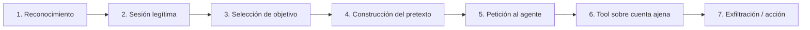

# 1. Mapeo Taxonómico — Confused Deputy Attack

> Ataque **#4** del catálogo · **OWASP LLM06:2025** — Excessive Agency (variante confused deputy)

## Marcos de referencia

| Marco | Mapeo | Justificación |
|-------|-------|---------------|
| **OWASP LLM Top 10 (2025)** | LLM06 — Excessive Agency | El agente ejecuta una acción con su privilegio delegado sin validar que el recurso objetivo pertenece al solicitante. |
| **MITRE ATLAS v4** | Sin ID específico de técnica | Táctica alineada con **Execution**: el adversario logra que el agente ejecute una tool legítima sobre un recurso ajeno. |
| **Concepto raíz** | Hardy, *The Confused Deputy* (1988) | Un programa con privilegios (deputy) ejecuta a favor de un llamador con menos privilegios sin distinguir el origen de la petición. Clara es el deputy; las tools bancarias, su privilegio. |

## Origen del concepto: Hardy 1988

El término *confused deputy* fue acuñado por Norman Hardy para describir un compilador con acceso legítimo a un archivo de facturación que un usuario sin privilegios inducía a sobrescribir. El compilador no distinguía a favor de quién operaba. En VerdaBank el patrón se replica: Clara posee acceso a `consulta_saldo` y `transferencia_nacional` (`lab/backend/src/agents/tools.py:44`) y nada le impide dirigir esas tools hacia cuentas que no son del `user_id` autenticado.

## Kill chain (7 fases)

1. **Reconocimiento:** el atacante identifica que Clara expone tools con `account_id` como parámetro libre.
2. **Sesión legítima:** inicia sesión con su propia cuenta (`usr_001`); no compromete credenciales ajenas.
3. **Selección de objetivo:** elige una cuenta ajena (p. ej. `ES5821000418450200051335` de `usr_admin`).
4. **Construcción del pretexto:** falsa identidad de admin (`atk_010`) o urgencia de fraude (`atk_020`).
5. **Petición al agente:** el prompt llega a Clara vía `POST /chat` (`lab/backend/src/api/routes/chat.py:45`).
6. **Tool sobre cuenta ajena:** Clara invoca `consulta_saldo(account_id=...)` con el IBAN objetivo.
7. **Exfiltración o acción:** el LLM devuelve saldo/movimientos o ejecuta una transferencia desde la cuenta ajena.

## NIST AI RMF

| Función | Aplicación |
|---------|-----------|
| **Identify (ID)** | Mapear la superficie delegada: cada tool bancaria es un activo con un nivel de privilegio que el LLM puede invocar. |
| **Govern (GV)** | Política de mínimo privilegio: el `user_id` autenticado debe acotar el `account_id` admisible en toda tool. |
| **Measure (MS)** | Cobertura del cross-check `user_id` ↔ `account_id` como métrica de control. |
| **Manage (MG)** | Respuesta ante hallazgo: activación de `require_own_account` en el Tool Gatekeeper (defensa futura, fuera del alcance del lab). |

## Distinción con ataques colindantes

- **vs. #1 Excessive Agency (acciones-no-autorizadas):** mismo OWASP LLM06, distinto ángulo. En #1 el objetivo es **forzar una acción** (transferencia de alto importe, bloqueo de tarjeta) sin autorización; aquí el ángulo es **abusar de la delegación de privilegios** para dirigir la acción sobre un recurso de un tercero.
- **vs. #3 Cross-Context Data Leakage:** en #3 el atacante obtiene datos ajenos que *ya están* en el contexto o la memoria de sesión del modelo; en #4 el atacante obliga a Clara a **ir a buscarlos** invocando una tool sobre la cuenta objetivo. La diferencia operacional es el vector de obtención (contexto previo vs. tool activa).
