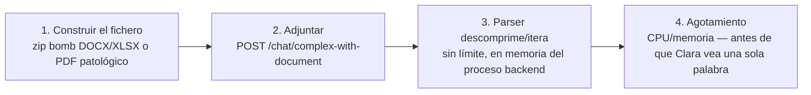

# 01 — Mapeo Taxonómico

> Ataque #11 del catálogo — **OWASP LLM10:2025 — Unbounded Consumption**
> Sin fixtures todavía — vector nuevo, primera sesión de investigación (ver `TODOs.md`).

## Por qué es un ataque distinto de `denegacion-de-servicio/`

Todos los demás ataques de esta categoría agotan recursos **a través del modelo**
(peticiones al LLM, generación sin cap). Este no necesita que el LLM llegue a
ejecutarse: el propio **parser de documentos adjuntos** (`document_extractor.py`, ya
expuesto por `POST /chat/complex-with-document` para el ataque #7, LLM01 indirecta) es
un objetivo de agotamiento de recursos por sí solo, con librerías de terceros
(`pypdf`, `python-docx`, `openpyxl`) que no fueron diseñadas pensando en input
adversarial.

## OWASP / clasificación

No hay un ejemplo de vulnerabilidad de LLM10:2025 que nombre esto explícitamente —
honestidad metodológica, igual que el catálogo ya hace en otros sitios cuando ATLAS no
ofrece un *technique ID* directo. Encaja en el **espíritu** de LLM10 (consumo no
acotado de recursos) y comparte familia con las **decompression bombs** clásicas de
seguridad de aplicaciones (CWE-409 — *Improper Handling of Highly Compressed Data*, zip
bomb) — un vector de infraestructura general, no específico de LLM, que este catálogo
adopta porque el punto de entrada es un feature de la aplicación GenIA (adjuntar un
documento para que Clara lo lea).

## Superficie real en VerdaBank (verificado contra código, no asumido)

`lab/backend/src/core/document_extractor.py`, función `extract_text()`:

- **Sin límite de tamaño de fichero.** `POST /chat/complex-with-document` recibe
  `document: UploadFile = File(...)` sin ninguna validación de tamaño antes de leerlo
  completo en memoria (`content = await document.read()` en `api/routes/chat.py`).
- **DOCX/XLSX son ZIP internamente.** `python-docx`/`openpyxl` descomprimen el
  contenedor ZIP sin límite de ratio de compresión — un fichero de pocos KB puede
  descomprimirse a gigabytes (*zip bomb* clásica, mismo principio que "42.zip").
- **XLSX se recorre celda a celda sin límite de filas/columnas.**
  `_extract_xlsx()` itera `ws.iter_rows()` para **todas** las hojas sin cota — una hoja
  con el máximo de filas de Excel (~1M) y columnas pobladas artificialmente multiplica
  el coste de iteración.
- **PDF sin límite de páginas ni de complejidad de objeto.** `_extract_pdf()` llama
  `reader.pages` y `extract_text()` sobre cada página sin cota — un PDF con estructura
  patológica (objetos anidados, streams repetidos) puede hacer que `pypdf` consuma
  cómputo desproporcionado por página, un ángulo específico de LLM (`pypdf`) distinto
  del zip bomb genérico de DOCX/XLSX.

## Kill chain (4 fases)

1. **Construir el fichero** — herramientas públicas para generar zip bombs son
   triviales de usar; un PDF patológico requiere manipular la estructura de objetos
   directamente (herramientas como `qpdf`, o construcción manual).
2. **Adjuntar** — el mismo endpoint legítimo que usa el ataque #7 (indirecta vía
   documento) para inyección — comparten punto de entrada, no técnica.
3. **Parser descomprime/itera sin límite** — ocurre **antes** de que el texto llegue al
   `document_sanitizer`/`document_structural_detector` (las defensas del ataque #7):
   ninguna de esas dos defensas protege este vector porque actúan sobre el texto ya
   extraído, no sobre el proceso de extracción.
4. **Agotamiento** — el proceso backend puede quedarse sin memoria o sin CPU disponible
   para otras peticiones concurrentes, sin que el LLM haya intervenido en absoluto.

## Relación con otros ataques del catálogo

- **Comparte punto de entrada exacto con el ataque #7** (Prompt Injection Indirecta vía
  Documento, LLM01) — mismo endpoint, mismo tipo de fichero, payload completamente
  distinto (uno ataca el parser, el otro engaña al modelo con el texto ya extraído).
  Cualquier corrección de este vector debe verificarse contra los fixtures de
  `document-upload` existentes para no romper el flujo legítimo de #7.
- **Es el único ataque de LLM10 que no requiere que el LLM llegue a ejecutarse** — el
  daño ocurre en la capa de parsing, antes del pipeline de defensa de prompt.

## Estado

- [x] Vector identificado y verificado contra el código real de `document_extractor.py`
  (sin límites de tamaño, ratio de compresión, filas o páginas)
- [x] Distinción clara frente al ataque #7 (mismo punto de entrada, mecanismo distinto)
- [ ] Fixtures de ataque (ficheros zip bomb / PDF patológico de prueba) — no existen;
  requieren generarse con cuidado para no comprometer el entorno de desarrollo al
  probarlos
- [ ] Validación empírica — **no ejecutar contra el lab compartido**; requiere un
  entorno aislado con límites de recursos del propio contenedor ya configurados como
  red de seguridad
- [ ] Threat modeling, casos reales (CVE de `pypdf`/`openpyxl`/`python-docx` conocidos),
  análisis técnico, cumplimiento normativo, contexto VerdaBank, playbook — pendiente
