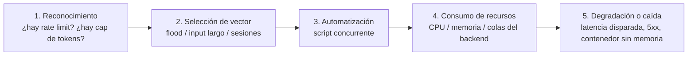

# 01 — Mapeo Taxonómico

> Ataque #8 del catálogo — **OWASP LLM10:2025 — Unbounded Consumption**
> Sin fixtures todavía — vector nuevo, primera sesión de investigación (ver `TODOs.md`).

## OWASP LLM Top 10 (2025)

- **LLM10:2025 — Unbounded Consumption**, subconjunto de ejemplos de vulnerabilidad
  centrados en disponibilidad (no en coste — ver `denial-of-wallet/`):
  - *Variable-Length Input Flood* — saturar el sistema con inputs de tamaño variable
    para agotar recursos.
  - *Continuous Input Overflow* — inputs que exceden la ventana de contexto, forzando
    tensión computacional.
  - *Resource-Intensive Queries* — consultas con patrones complejos que drenan CPU/memoria.
- Fuente: [OWASP GenAI Security Project — LLM10:2025](https://genai.owasp.org/llmrisk/llm102025-unbounded-consumption/).

## MITRE ATLAS (v4)

- **[AML.T0029 — Denial of ML Service](https://atlas.mitre.org/techniques/AML.T0029)**
  (táctica **Impact**): *"flooding an AI system with requests and junk traffic to
  degrade service for legitimate users"* — incluye tanto volumen puro (muchas peticiones
  simultáneas) como inputs diseñados para requerir cómputo desproporcionado por
  petición.

## Técnicas avanzadas (más allá del flood ingenuo)

El flood de peticiones (§ superficie real, abajo) es el caso trivial. La investigación
identifica tres técnicas más sofisticadas, cada una con literatura propia — se listan
porque un Rate Limiter simple (peticiones/minuto) **no detiene ninguna de las tres**:
el volumen de peticiones puede seguir siendo bajo.

- **Sponge examples (ataques energía-latencia).** Inputs optimizados específicamente
  para maximizar el cómputo/latencia de una única inferencia, no el volumen de
  peticiones. Shumailov et al. (IEEE EuroS&P 2021) midieron amplificaciones de hasta
  **6000×** en servicios de traducción reales con una sola petición cuidadosamente
  construida. Aplicable a Clara en principio — nadie lo ha probado contra este lab
  todavía. Fuente:
  [Sponge Examples: Energy-Latency Attacks on Neural Networks](https://ieeexplore.ieee.org/document/9581273/).
- **"Overthinking" en modelos con razonamiento explícito.** Técnica de 2025-2026,
  posterior al resto de la literatura citada en este catálogo: inducir a un modelo con
  *extended thinking* (el mismo concepto que `CONTEXT.md` ya nombra como "Thinking
  trace") a generar cadenas de razonamiento desproporcionadamente largas antes de
  responder — cada token de "pensamiento" cuesta cómputo/dinero igual que un token de
  respuesta. Relevante para este lab en la medida en que se evalúen modelos con
  razonamiento explícito (§9 de `TODOs.md`, comparativa multi-modelo). Fuentes:
  [ThinkTrap — DoS via Infinite Thinking](https://arxiv.org/pdf/2512.07086),
  [Inducing Overthink — GA-based DoS on Reasoning Models](https://arxiv.org/pdf/2605.13338).
- **Ataques al framework de serving, no al modelo.** En vez de craftear un prompt caro,
  se ataca la capa de *serving* (batching, scheduling de la cola de inferencia) del
  motor que sirve el modelo — en este lab, **Ollama**. Un patrón de peticiones que
  explote cómo el servidor agrupa/prioriza requests puede degradar el servicio sin que
  ningún prompt individual parezca sospechoso. Fuente:
  [Rethinking Latency DoS — Attacking the Serving Framework, Not the Model](https://arxiv.org/pdf/2602.07878).

## Superficie real en VerdaBank (verificado contra código, no asumido)

Tres huecos concretos, cada uno un ataque distinto dentro de esta misma categoría:

1. **Flood de peticiones.** `lab/backend/src/main.py` no monta rate limiting — nada
   impide N peticiones/segundo a `/chat/proxy` desde la misma IP o `user_id`.
2. **Generación sin techo.** Ninguna llamada a `clara_agent.run()`
   (`lab/backend/src/agents/clara_simple.py`, `clara_complex.py`) fija un límite de
   tokens de salida. Un prompt que induzca un bucle de razonamiento largo, una lista sin
   fin, o repetición forzada, consume cómputo (y tiempo de respuesta) sin límite
   superior.
3. **Sesiones sin cota.** `agents/session_store.py::_store` es un `dict` sin límite de
   entradas ni expiración — cada `session_id` nuevo (el cliente lo omite y el backend
   genera uno) es memoria que el proceso retiene indefinidamente. Un script que abra
   miles de sesiones agota la memoria del contenedor sin necesitar ni un solo mensaje
   "malicioso" en el sentido de prompt injection.

## Kill chain (5 fases)

1. **Reconocimiento** — probar si hay límites observables (headers `Retry-After`,
   `429`, degradación gradual vs. corte abrupto).
2. **Selección de vector** — flood de peticiones simples, o pocas peticiones con
   payloads diseñados para maximizar cómputo por petición (más sigiloso, más difícil de
   distinguir de tráfico legítimo).
3. **Automatización** — concurrencia real (no un usuario manual); coste bajo para el
   atacante, coste alto para el objetivo — asimetría característica de este vector.
4. **Consumo de recursos** — CPU del proceso Python, memoria de `session_store`, cola de
   peticiones a Ollama/proveedor externo.
5. **Degradación o caída** — desde latencia elevada para usuarios legítimos hasta
   `OOMKilled` del contenedor backend.

## Relación con otros ataques del catálogo

- **Ortogonal a los 7 ataques existentes** — no depende de convencer al modelo de nada;
  de hecho, un input completamente "legítimo" en su forma (una pregunta normal, repetida
  mil veces) es un vector válido.
- **Amplifica LLM06 (Excessive Agency)** si el atacante puede inducir a Clara a invocar
  tools en bucle (cada llamada a `transferencia_nacional`/`consulta_saldo` tiene un
  coste de cómputo y, si el proveedor es de pago, un coste monetario — cruce directo con
  `denial-of-wallet/`).
- **Comparte superficie con LLM07 (System Prompt Leakage)** en el sentido de que ambos
  se benefician de que el atacante pueda enviar muchas variantes sin fricción — aquí el
  volumen es el objetivo, no un medio.

## NIST AI RMF

| Función | Aplicación |
|---------|-----------|
| **Govern** | Definir presupuesto de disponibilidad (SLO) y quién puede ajustarlo. |
| **Map** | Identificar los tres huecos de arriba como activos sin control (`session_store.py`, ausencia de rate limiting, ausencia de `max_tokens`). |
| **Measure** | Telemetría de latencia p95/p99, peticiones/minuto por origen, tamaño de `session_store._store` — hoy no instrumentada. |
| **Manage** | Rate limiting, cap de tokens de salida, TTL/cota de sesiones (defensa futura, ver `docs/defensas/LLM10-unbounded-consumption/denegacion-de-servicio.md`). |

## Estado

- [x] Mapeo OWASP LLM10 + MITRE ATLAS AML.T0029 confirmado contra fuente oficial
- [x] Tres huecos verificados contra el código real del lab (no asumidos)
- [x] **Fixtures de ataque** — `llm10_001` (flood), `llm10_002` (token_burn) en
  `lab/backend/tests/fixtures/llm10_scenarios.yaml`, ejecutables con
  `lab/scripts/run_llm10_suite.py`
- [x] **Defensa implementada y evidencia capturada** — Rate Limiter + cap de tokens +
  cota de sesiones, ver `docs/defensas/LLM10-unbounded-consumption/denegacion-de-
  servicio.md` y `docs/reports/evidencia-llm10-unbounded-consumption.md`
- [ ] Validación empírica bajo carga de producción real (la corrida de evidencia usa
  el lab de desarrollo con volumen acotado, no un entorno de carga dedicado)
- [ ] Sponge examples / "overthinking" / ataque al framework de serving — identificados
  en la investigación (§ "Técnicas avanzadas"), sin fixture ni prueba empírica todavía
  compartido de desarrollo
- [ ] Threat modeling, casos reales, análisis técnico, cumplimiento normativo, contexto
  VerdaBank, playbook — pendiente
