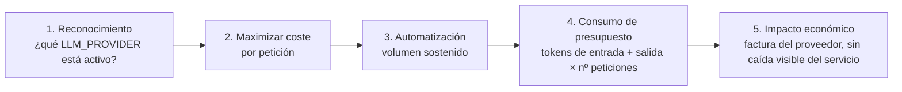

# 01 — Mapeo Taxonómico

> Ataque #9 del catálogo — **OWASP LLM10:2025 — Unbounded Consumption**
> Sin fixtures todavía — vector nuevo, primera sesión de investigación (ver `TODOs.md`).

## OWASP LLM Top 10 (2025)

- **LLM10:2025 — Unbounded Consumption**, ejemplo específico: **Denial of Wallet
  (DoW)** — *"exploiting pay-per-use pricing models through high-volume operations"*.
  A diferencia de un DoS clásico, el servicio puede seguir respondiendo con
  normalidad: el daño es la factura, no la caída.
- Fuente: [OWASP GenAI Security Project — LLM10:2025](https://genai.owasp.org/llmrisk/llm102025-unbounded-consumption/).

## MITRE ATLAS (v4)

- **[AML.T0034 — Cost Harvesting](https://atlas.mitre.org/techniques/AML.T0034)**
  (táctica **Impact**): *"sending high-volume or computationally expensive queries to a
  model API to generate costs for the operator. For metered deployments, this is a form
  of denial of wallet. For on-premises deployments, it degrades availability without
  disabling the system, and is frequently combined with adversarial inputs designed to
  maximize token consumption per query."*

  La propia definición de ATLAS ya distingue los dos despliegues que el lab soporta:
  **metered** (OpenRouter, Groq, NVIDIA NIM — coste monetario real por token) y
  **on-premises** (Ollama local — coste de cómputo/tiempo, sin factura, pero el mismo
  patrón de ataque).

## Superficie real en VerdaBank (verificado contra código, no asumido)

- **Multi-proveedor por diseño.** `lab/README.md` § "Proveedores LLM" documenta 5
  configuraciones: Ollama local, Ollama en host, OpenRouter, Groq, NVIDIA NIM. Cambiar
  de `LLM_PROVIDER=ollama` a `openrouter`/`custom` convierte cada token generado en
  coste monetario directo — sin que el código de `agents/clara_*.py` cambie una línea.
- **Sin cap de tokens de salida** (mismo hueco que `denegacion-de-servicio/`, con efecto
  distinto aquí: cada token de más generado por un proveedor de pago es coste, no solo
  latencia).
- **Sin presupuesto por sesión/usuario.** No existe ningún acumulador de coste ni de
  tokens consumidos por `user_id` — a diferencia de `MAX_TURNS` en `session_store.py`
  (que limita turnos, no tokens ni coste), no hay ningún corte cuando un usuario supera
  un umbral de gasto.
- **Tool calls tienen coste propio.** Cada llamada a una tool bancaria
  (`consulta_saldo`, `transferencia_nacional`...) implica al menos una ronda adicional
  de tokens de entrada/salida con el proveedor — un prompt que induzca a Clara a invocar
  tools repetidamente (cruce con Excessive Agency, LLM06) multiplica el coste por ronda.

## Kill chain (5 fases)

1. **Reconocimiento** — el proveedor activo no es observable desde fuera en este lab
   (no hay fixture ni endpoint que lo revele), pero un atacante con acceso a `.env` o a
   la documentación pública del despliegue lo sabría.
2. **Maximizar coste por petición** — prompts diseñados para forzar respuestas largas
   ("enumera con el máximo detalle posible...", listas abiertas, peticiones de
   traducción/reescritura de textos largos que el propio atacante adjunta), o para
   encadenar varias tool calls.
3. **Automatización** — volumen sostenido en el tiempo, deliberadamente por debajo de
   cualquier umbral de detección de flood (esto es DoW, no necesariamente DoS — puede
   ser lento y silencioso).
4. **Consumo de presupuesto** — tokens de entrada (el propio prompt, si es largo) +
   tokens de salida (sin cap) × número de peticiones.
5. **Impacto económico** — factura del proveedor sin que el SOC del lab (que observa
   Analysis Events de las defensas, no coste) tenga ninguna señal que mostrar hoy.

## Relación con otros ataques del catálogo

- **Mismo mecanismo de fondo que `denegacion-de-servicio/`** — la distinción es el daño
  (coste vs. caída), no el vector de entrada; un mismo script de flood puede producir
  ambos efectos a la vez según el proveedor activo.
- **Amplificado por LLM06 (Excessive Agency)**: cada tool call inducida es una ronda de
  tokens adicional — un ataque de *confused deputy* o *acciones no autorizadas* exitoso
  también quema presupuesto como efecto secundario, no solo dinero real transferido.
- **El propio Agente de red-team del proyecto** (`lab/redteam-agent/`) es, sin
  proponérselo, un cliente de alto volumen contra el proveedor LLM — una Campaña de 20
  intentos × 6 Ejercicios genera decenas de llamadas. Si el lab corriera contra un
  proveedor de pago, correr el Agente de red-team sin presupuesto acotado sería este
  mismo vector aplicado contra el propio equipo — nota para cuando se documente la
  defensa.

## NIST AI RMF

| Función | Aplicación |
|---------|-----------|
| **Govern** | Presupuesto máximo por entorno/proveedor, quién lo autoriza a subir. |
| **Map** | Proveedores de pago identificados (`lab/README.md`), coste por token no instrumentado. |
| **Measure** | Tokens consumidos por sesión/usuario/día — hoy no se mide en ningún sitio del lab. |
| **Manage** | Presupuesto duro por usuario/sesión, cap de tokens de salida, alertas de gasto anómalo (defensa futura, ver `docs/defensas/LLM10-unbounded-consumption/denial-of-wallet.md`). |

## Estado

- [x] Mapeo OWASP LLM10 + MITRE ATLAS AML.T0034 confirmado contra fuente oficial
- [x] Huecos verificados contra el código real del lab (multi-proveedor, sin cap de
  tokens, sin presupuesto por usuario)
- [x] **Fixture de ataque** — `llm10_003` (budget_burn) en `llm10_scenarios.yaml`,
  ejecutable con `run_llm10_suite.py`
- [x] **Defensa implementada y evidencia capturada** — Budget Guard (presupuesto por
  usuario, corte duro sobre el consumo real), ver `docs/defensas/LLM10-unbounded-
  consumption/denial-of-wallet.md` y la validación histórica conservada en Git
- [ ] Medición de coste real por proveedor (€/1M tokens de cada proveedor soportado) —
  pendiente, requiere decidir si se corre contra un proveedor de pago real o se simula
  (el Budget Guard actual cuenta tokens, no €)
- [ ] Threat modeling, casos reales, análisis técnico, cumplimiento normativo, contexto
  VerdaBank, playbook — pendiente
