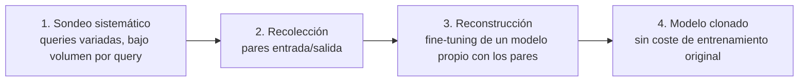

# 01 — Mapeo Taxonómico

> Ataque #10 del catálogo — **OWASP LLM10:2025 — Unbounded Consumption**
> Sin fixtures todavía — vector nuevo, primera sesión de investigación (ver `TODOs.md`).

## OWASP LLM Top 10 (2025)

Tres ejemplos de vulnerabilidad de LLM10:2025 que **no** son de disponibilidad/coste
sino de **confidencialidad del propio modelo** — se agrupan aparte de
`denegacion-de-servicio/` y `denial-of-wallet/` porque el daño y la defensa son
distintos, aunque el mecanismo (volumen de queries) sea el mismo:

- *Model Extraction via API* — consultar el modelo de forma estratégica para
  recolectar suficientes pares entrada/salida y reconstruir su comportamiento.
- *Functional Model Replication* — usar el modelo objetivo para generar datos de
  entrenamiento sintéticos y clonar un modelo funcionalmente equivalente (más barato
  que entrenar desde cero).
- *Side-Channel Attacks* — explotar el filtrado de inputs u otras señales indirectas
  (latencia, formato de rechazo) para inferir pesos o detalles de arquitectura sin
  acceso directo a ellos.

Fuente: [OWASP GenAI Security Project — LLM10:2025](https://genai.owasp.org/llmrisk/llm102025-unbounded-consumption/).

## MITRE ATLAS (v4)

- **[AML.T0024 — Exfiltration via AI Inference API](https://atlas.mitre.org/techniques/AML.T0024)**
  (táctica **Exfiltration**): *"adversaries may exfiltrate private information via AI
  Model Inference API Access, as ML Models have been shown to leak private information
  about their training data. Additionally, the model itself may also be extracted for
  the purposes of ML Intellectual Property Theft."* Cubre tanto la fuga de datos de
  entrenamiento (*model inversion*) como el robo del propio modelo.

## Por qué "infraestructura" y no "inteligencia"

Encaja en esta categoría (LLM10, no LLM02 Sensitive Information Disclosure) porque el
mecanismo de ataque es el mismo que DoS/DoW — **volumen de peticiones**, no un payload
que engañe al modelo en un solo turno. La diferencia es el objetivo: en vez de agotar
recursos o presupuesto, el volumen se usa para **muestrear el comportamiento del modelo**
hasta poder reconstruirlo o extraer lo que memorizó.

## Superficie real en VerdaBank (verificado contra código, no asumido)

- **Sin cap de tokens ni rate limiting** (mismo hueco que `denegacion-de-servicio/`) —
  condición necesaria para poder hacer el volumen de queries que este ataque requiere
  sin ser cortado antes.
- **`fixture_id` es opcional en `ChatRequest`** y `GET /api/v1/fixtures` expone el
  catálogo completo de fixtures del lab — un atacante externo con acceso a esa lista
  conoce de antemano qué payloads provocan qué comportamiento, reduciendo el número de
  queries de sondeo necesarias frente a un sistema real donde esa lista sería privada.
  (Nota de alcance: en el lab esto es deliberado — el catálogo es público a propósito
  para depuración — pero un despliegue real no debería exponer un endpoint equivalente.)
- **Ollama local (`qwen2.5:3b`) es en sí mismo un modelo público** — extraerlo no tiene
  valor de IP en este lab concreto. El vector cobra sentido si el `LLM_PROVIDER` activo
  es un modelo propietario de pago (OpenRouter con un modelo cerrado) — el mismo cruce
  multi-proveedor que ya señala `denial-of-wallet/`.

## Kill chain (4 fases)

1. **Sondeo sistemático** — a diferencia de DoS (volumen alto, ráfaga), aquí el
   volumen puede ser bajo y sostenido para no disparar ningún rate limit — el objetivo
   es cobertura del espacio de entradas, no velocidad.
2. **Recolección** — cada respuesta es un dato de entrenamiento para el modelo clon.
3. **Reconstrucción** — *Functional Model Replication*: entrenar un modelo más barato
   con los pares recolectados hasta igualar el comportamiento observable.
4. **Modelo clonado** — el atacante obtiene un sustituto funcional sin pagar el coste
   de entrenamiento ni de licencia del original.

## Relación con otros ataques del catálogo

- **Comparte la superficie de `denial-of-wallet/`** (mismo volumen de queries, mismo
  hueco de ausencia de presupuesto) pero con objetivo de confidencialidad, no de daño
  económico directo al operador.
- **LLM07 (System Prompt Leakage)** es un caso particular y más simple de exfiltración
  vía inferencia — pide directamente el secreto en vez de reconstruirlo por muestreo
  estadístico.

## Estado

- [x] Mapeo OWASP LLM10 + MITRE ATLAS AML.T0024 confirmado contra fuente oficial
- [x] Aplicabilidad a este lab evaluada con honestidad (bajo valor con Ollama local,
  relevante solo si el proveedor activo es un modelo propietario)
- [ ] Fixtures de ataque — no existen, y probablemente no aplican al lab en su
  configuración por defecto (ver nota de Ollama local arriba)
- [ ] Threat modeling, casos reales, análisis técnico, cumplimiento normativo, contexto
  VerdaBank, playbook — pendiente
