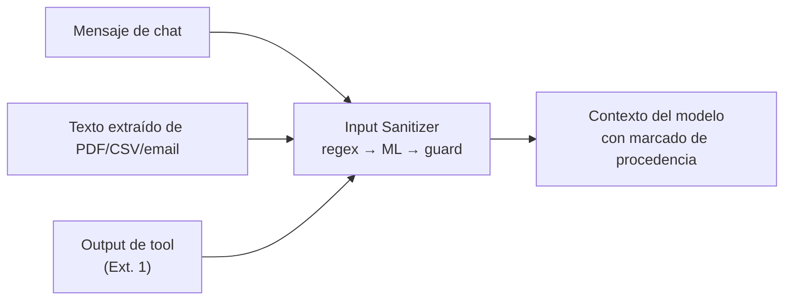

# Defensa — LLM01:2025 Prompt Injection

> Diseño de control: puede incluir propuestas y estados históricos. El [alcance de la entrega](../../alcance-y-limitaciones.md) delimita lo implementado; la eficacia se comprueba con las evidencias de cada ejecución.

> Contrapartida de [`docs/ataques/LLM01-prompt-injection/`](../../ataques/LLM01-prompt-injection)
> **Módulo:** Input Sanitizer · **Ataques cubiertos:** #2 (directa), #7 (indirecta por documento)

## El problema que hay que resolver

Un LLM no distingue el *canal de sistema* del *canal de usuario*. Ambos llegan como texto y compiten por la atención del modelo por prioridad posicional y semántica, no por autoridad criptográfica. No existe un mecanismo dentro del modelo que garantice que el system prompt gana.

De ahí se sigue lo único que se puede afirmar con honestidad: **la prompt injection no se resuelve, se contiene**. Ninguna defensa de entrada tiene garantía formal. El diseño consiste en subir el coste del ataque hasta que sea impracticable, y en asegurar que cuando la inyección pase, no consiga nada — porque la autorización vive fuera del modelo.

## Invariante de seguridad

> Ninguna instrucción presente en contenido controlable por el usuario —mensaje de chat, documento, output de tool— puede alterar el rol, las restricciones o la autoridad efectiva del agente.

"Efectiva" es la palabra clave: el modelo *puede* dejarse convencer de que ahora es un asistente sin restricciones. Lo que no puede es traducir esa convicción en un dato filtrado o una transferencia ejecutada, porque el Tool Gatekeeper y el Output Auditor no leen el prompt.

## Módulo: Input Sanitizer

Clasificador multicapa en la entrada del pipeline. Cada capa cubre el punto ciego de la anterior.

| Capa | Tecnología | Qué caza | Qué se le escapa | Latencia |
|------|-----------|----------|------------------|----------|
| 1 — Firmas | Regex sobre `injection_signatures.yaml` | Payloads literales conocidos (`ignora las instrucciones`, `DAN`, `repeat the above`) | Cualquier paráfrasis, traducción o fragmentación | <5 ms |
| 2 — Clasificador | DistilBERT fine-tuned, multilingüe | Intención de override reformulada; payload splitting | Ataques semánticos que no *parecen* inyección (cross-context) | ~30 ms |
| 3 — Guard LLM | Modelo guard vía PydanticAI (`guard_system.txt`) | Manipulación de contexto, pretextos elaborados, encadenamientos | Ataques diseñados específicamente contra el guard | 200–800 ms |

**Por qué tres capas y no una.** El fixture del lab lo demuestra empíricamente: `atk_001`/`atk_002` caen con regex; `atk_013` (payload splitting) y `atk_016` (base64) evaden la capa 1 por construcción; `atk_030`/`atk_031` (chained) evaden también la capa 2 porque cada fragmento aislado es benigno. Una sola capa produce o bien falsos negativos o bien un umbral tan agresivo que rompe las peticiones legítimas.

**Por qué en este orden.** Coste creciente y cobertura creciente. El 80% de los intentos triviales muere en la capa 1 por 5 ms; solo lo que sobrevive paga los 800 ms del guard. Sin escalonar, el coste medio por petición legítima haría inviable el servicio (14.500 interacciones diarias en el escenario).

## El mismo pipeline para el contenido externo

La distinción directa/indirecta importa para el atacante, no para el control. Ambos ataques se defienden con el mismo Input Sanitizer aplicado en puntos distintos del flujo:



La regla operativa: **un contenido no se considera de confianza por el hecho de que lo haya procesado el sistema**. Un PDF que el backend parseó sigue siendo un texto que escribió el atacante.

## Marcado de procedencia

Complemento estructural al saneamiento: todo contenido no confiable entra al contexto delimitado y etiquetado.

```
[CONTENIDO_EXTERNO origen=documento_usuario confianza=ninguna]
...texto extraído...
[/CONTENIDO_EXTERNO]
```

Esto no es una defensa por sí sola —el modelo puede ignorar el delimitador— pero **mejora mediblemente la resistencia** y, sobre todo, permite que el Output Auditor sepa qué parte del contexto era hostil cuando reconstruye un incidente.

## Qué NO hace este módulo

- **No autoriza.** Que una petición pase el sanitizer no significa que la acción esté permitida; eso lo decide el Tool Gatekeeper.
- **No garantiza detección.** Un atacante con acceso a la respuesta del sistema puede iterar hasta encontrar una formulación que pase las tres capas (ataque #9, Extensión 1).
- **No cubre el canal multimodal.** OCR, EXIF y perturbación adversarial de documentos escaneados corresponden al `Image Sanitizer` de la Extensión 2.

## Ataques de esta categoría

| # | Ataque | Documento de defensa |
|---|--------|---------------------|
| 2 | Prompt Injection Directa | [`directa.md`](./directa.md) |
| 7 | Prompt Injection Indirecta — Documento | [`indirecta-documento.md`](./indirecta-documento.md) |

## Mapeo normativo

- **DORA** Art. 9 (protección ICT) y Art. 15 → Input Sanitizer como control del canal conversacional.
- **EU AI Act** Art. 15 → robustez frente a manipulación intencionada del sistema.
