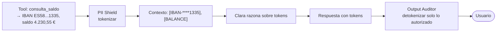

# Defensa — LLM02:2025 Sensitive Information Disclosure

> Diseño de control: puede incluir propuestas y estados históricos. El [alcance de la entrega](../../alcance-y-limitaciones.md) delimita lo implementado; la eficacia se comprueba con las evidencias de cada ejecución.

> Contrapartida de [`docs/ataques/LLM02-sensitive-information-disclosure/`](../../ataques/LLM02-sensitive-information-disclosure)
> **Módulos:** PII Shield (prevención) + Output Auditor (verificación) · **Ataques cubiertos:** #3 (cross-context), #6 (PII harvesting)

## El problema que hay que resolver

Es la categoría de **mayor impacto regulatorio** del catálogo: cualquier filtrado de dato personal activa el reloj de 72 horas del GDPR Art. 33. Y es la categoría del incidente motivador del TFM (INC-2025-0089).

El problema técnico de fondo: **un LLM no tiene un modelo de control de acceso**. Cualquier dato que entra en su ventana de contexto es, para el modelo, igual de disponible que cualquier otro. No hay una etiqueta interna que diga "este IBAN pertenece a otro cliente". Si el dato está en el contexto, el modelo puede emitirlo — y basta una formulación suficientemente convincente para que lo haga.

## Los dos flancos

| Flanco | Ataque | Pregunta que responde la defensa |
|--------|--------|----------------------------------|
| **Prevención** | #6 PII Harvesting | ¿Y si el modelo nunca llega a ver el dato real? |
| **Verificación** | #3 Cross-Context Leakage | ¿Y si lo ve, y aun así el dato ajeno no puede salir? |

Los dos módulos son complementarios porque atacan momentos distintos. El PII Shield reduce la superficie: lo que no está en el contexto no se filtra. El Output Auditor cubre lo que sí tiene que estar: el saldo propio del usuario sí debe llegarle, y decidir si un dato concreto es legítimo requiere comparar contra la sesión, no solo detectar un patrón.

## Módulo 1 — PII Shield (prevención)

Tokenización reversible de datos financieros **antes** de que entren al contexto del modelo.

**Patrones cubiertos** — `lab/backend/config/rules/banking_patterns.yaml`: IBAN, Visa, Mastercard, SWIFT, saldo en euros, teléfono, email, DNI/NIE. Presidio aporta el NER genérico (nombres, direcciones); los patrones custom cubren lo bancario español.

**Por qué tokens reversibles y no redacción destructiva.** Clara tiene que poder responder "tu cuenta terminada en 1335 tiene saldo suficiente". Con redacción destructiva pierde la capacidad de referirse al dato; con tokens conserva la referencia sin conocer el valor. El mapeo token→valor vive en el store de sesión del proxy, **nunca en el contexto del modelo**.

**Propiedad clave:** la tokenización es determinista dentro de una sesión (el mismo IBAN produce el mismo token) pero no entre sesiones. Así el modelo puede razonar sobre identidad ("es la misma cuenta que antes") sin que el token sea útil fuera de la sesión.

## Módulo 2 — Output Auditor (verificación)

Último control del pipeline. Escanea la respuesta generada y **cruza cada dato financiero contra las cuentas legítimas del `user_id` autenticado**.

| Comprobación | Regla |
|-------------|-------|
| IBAN en la respuesta | Debe pertenecer a una cuenta del `user_id` de la sesión |
| Saldo o importe de posición | Debe corresponder a una cuenta del `user_id` |
| Número de tarjeta | Debe pertenecer al `user_id` |
| Token no resuelto | Un token que llega al usuario sin detokenizar es un bug: se bloquea la respuesta |
| Dato presente en el output pero ausente del contexto autorizado | Alucinación o filtrado: se bloquea |

La comparación es contra **la lista de cuentas del usuario**, no contra un patrón de sospecha. Ese es el punto: no intenta adivinar si el dato es sensible, comprueba si es *suyo*.

## Principio compartido

> Nunca confiar en que el LLM "decida bien" qué puede revelar. La frontera entre usuarios es una comprobación de igualdad, no un juicio semántico.

Este principio es el que hace la defensa demostrable ante un regulador. "El modelo está entrenado para no revelar datos ajenos" no es un control auditable. "Ninguna respuesta sale sin que cada IBAN haya sido comparado con las cuentas del titular autenticado, y cada comparación queda registrada" sí lo es.

## Interacción con los otros módulos

- **Input Sanitizer** filtra las peticiones que *piden* datos ajenos de forma reconocible (`account_manipulation` en `injection_signatures.yaml`), pero `atk_025` demuestra que la formulación ambigua pasa. No es una defensa suficiente para esta categoría.
- **Tool Gatekeeper** impide que la tool devuelva el dato ajeno en primer lugar (`require_own_account: true`). Es, de hecho, la defensa más efectiva contra el ataque #3 — el Output Auditor es la red de seguridad para lo que ya está en contexto por otras vías.

## Ataques de esta categoría

| # | Ataque | Módulo principal | Documento |
|---|--------|-----------------|-----------|
| 3 | Cross-Context Data Leakage | Output Auditor | [`cross-context-leakage.md`](./cross-context-leakage.md) |
| 6 | PII Harvesting vía Contexto | PII Shield | [`pii-harvesting.md`](./pii-harvesting.md) |

## Mapeo normativo

- **GDPR** Art. 5.1.c (minimización) → PII Shield; Art. 32 (medidas técnicas) → ambos módulos; Art. 33 (notificación) → el Output Auditor es lo que convierte una brecha silenciosa en un evento detectado y fechado.
- **EU AI Act** Art. 15 (robustez) y Art. 13 (trazabilidad).
- **DORA** Art. 9 → Output Auditor como control de salida del canal.
