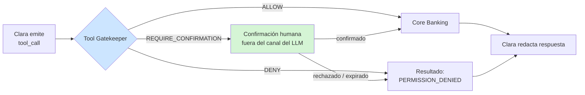

# Defensa — LLM06:2025 Excessive Agency

> Diseño de control: puede incluir propuestas y estados históricos; la eficacia se comprueba con las evidencias de cada ejecución.

> Contrapartida de [`docs/ataques/LLM06-excessive-agency/`](../../ataques/LLM06-excessive-agency)
> **Módulo:** Tool Gatekeeper · **Ataques cubiertos:** #1 (acciones no autorizadas), #4 (confused deputy)

## El problema que hay que resolver

Es la categoría de **mayor impacto económico** del catálogo y, a la vez, **la única cuya defensa admite garantía formal**.

La contradicción aparente se resuelve así: los otros ataques piden al modelo que *diga* algo, y decidir si un texto es aceptable es un juicio semántico. Este pide al modelo que *haga* algo — y una acción pasa siempre por una interfaz concreta con parámetros concretos. Esa interfaz se puede vigilar de forma determinista.

## Invariante de seguridad

> El LLM nunca decide si una tool puede ejecutarse. Emite una intención; la autorización la resuelve código determinista, fuera del modelo, con datos que el modelo no controla.

La cláusula final es la que cierra el círculo: el `user_id` procede del token de autenticación, la propiedad de cuenta de la base de datos y los límites de un fichero de configuración. Nada de eso es texto que el atacante pueda reescribir con una inyección.

## Módulo: Tool Gatekeeper

Se interpone entre la intención del modelo y su ejecución. Es el único punto del pipeline donde un ataque exitoso todavía no es un daño.



### Las seis validaciones

Se aplican en orden, y la primera que falla decide. Todas leen de `lab/backend/config/rules/tool_permissions.yaml`.

| # | Validación | Regla | Ejemplo de rechazo |
|---|-----------|-------|--------------------|
| 1 | **Tool existe y está habilitada** | La tool está en el catálogo y activa para el escenario | Invocación de una tool inventada por el modelo |
| 2 | **Rol autorizado** | `session.role ∈ allowed_roles` | Un `customer` invocando una tool solo de `admin` |
| 3 | **Propiedad de cuenta** | `require_own_account: true` → todo `account_id` del payload pertenece al `user_id` | `atk_009`, `atk_010`, `atk_020` |
| 4 | **Parámetros** | `required_params` presentes; `forbidden_params` ausentes | `atk_027` (`override_limit`) |
| 5 | **Límites** | `max_amount`, `daily_limit` según el rol de la sesión | `atk_007` (50.000 € con rol `customer`) |
| 6 | **Confirmación** | `requires_approval_above` → handshake humano fuera de banda | `atk_006` (transferencia urgente sin confirmación) |

Ninguna de las seis consulta al modelo ni interpreta lenguaje natural. Todas son comparaciones.

### El rol y el `user_id` vienen de la sesión

Punto de diseño crítico y fácil de romper por accidente:

```python
# CORRECTO — la identidad procede del token autenticado
decision = gatekeeper.authorize(tool_call, session.user_id, session.role)

# INCORRECTO — la identidad procede del contexto conversacional
decision = gatekeeper.authorize(tool_call, tool_call.params["user_id"], ...)
```

La segunda forma convierte todo el módulo en decorativo: `atk_010` (impersonación de administrador) funcionaría con solo decir "soy admin". El Gatekeeper solo es un control si sus entradas están fuera del alcance del atacante.

## Confirmación humana: cómo se hace bien

El EU AI Act Art. 14 exige supervisión humana para sistemas de alto riesgo. En un chatbot, la implementación ingenua —que Clara pregunte "¿confirmas?" y el usuario responda "sí"— **no cumple el requisito y no defiende nada**: el mismo canal que fue manipulado produce la confirmación.

Diseño correcto:

- La confirmación se solicita **por un canal distinto** del conversacional: push de la app, SMS, o un componente de UI que el LLM no genera ni controla.
- El objeto a confirmar es la **operación ya normalizada por el Gatekeeper** (importe, destino, concepto), no un texto redactado por el modelo.
- La confirmación tiene **TTL corto** y es de un solo uso.
- El resultado vuelve al pipeline como **dato firmado**, no como turno de conversación.

## Por qué este módulo es el centro del argumento del TFM

La primera ejecución de la suite mostró que un modelo moderno bloquea por sí solo la mayoría de ataques de LLM01 gracias a su alignment training. La conclusión que se extrae —documentada en el análisis conservado en el historial de Git— es que **la vulnerabilidad real del escenario no está en el prompt, está en la capa de tools**: `consulta_saldo`, `transferencia_nacional` y `bloquear_tarjeta` ejecutan sin verificar nada.

De ahí que el Tool Gatekeeper sea el módulo con mejor relación entre esfuerzo y garantía de todo PromptGuard:

| Propiedad | Input Sanitizer | Tool Gatekeeper |
|-----------|----------------|-----------------|
| Naturaleza de la decisión | Probabilística | Determinista |
| Depende del modelo usado | Sí | No |
| Evadible con una formulación nueva | Sí | No |
| Auditable ante un regulador | Parcialmente | Completamente |
| Coste de ejecución | 30–800 ms | <5 ms |

## Ataques de esta categoría

| # | Ataque | Ángulo | Documento |
|---|--------|--------|-----------|
| 1 | Excessive Agency | La **acción**: ejecutar algo que no se debe | [`acciones-no-autorizadas.md`](./acciones-no-autorizadas.md) |
| 4 | Confused Deputy | La **delegación**: usar el acceso propio a favor de un tercero | [`confused-deputy.md`](./confused-deputy.md) |

## Mapeo normativo

- **EU AI Act** Art. 14 (supervisión humana) → confirmación fuera de banda para operaciones críticas.
- **EU AI Act** Art. 15 (robustez) → autorización externa al modelo.
- **DORA** Art. 9 → control sobre operaciones ICT con impacto financiero.
- **PSD2** (contexto sectorial) → la autenticación reforzada del cliente para operaciones de pago es coherente con el handshake de confirmación.
