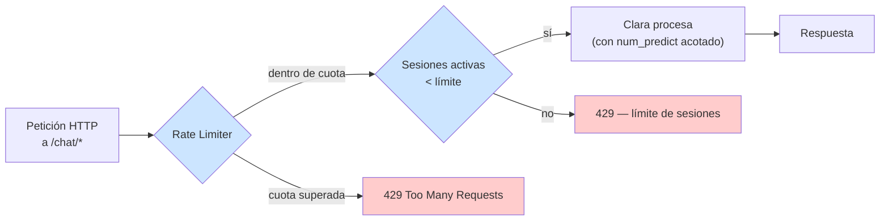

# Defensa — LLM10:2025 Unbounded Consumption

> Contrapartida de [`docs/ataques/LLM10-unbounded-consumption/`](../../ataques/LLM10-unbounded-consumption)
> **Módulos:** Rate Limiter, Budget Guard, Query Pattern Monitor, Document Size Guard (ninguno implementado)
> **Ataques cubiertos:** #8 (denegación de servicio), #9 (denial of wallet), #10 (extracción de modelo), #11 (amplificación vía documentos adjuntos)
>
> Primera sesión de investigación — diseño de control, sin código ni fixtures. Mismo
> aviso que el resto del catálogo: ningún módulo de PromptGuard cubre esta categoría
> todavía. Ver `TODOs.md` § "Ataques a la infraestructura".

## El problema que hay que resolver

Las otras seis defensas del catálogo (`LLM01`, `LLM02`, `LLM06`, `LLM07`) responden a la
misma pregunta: *¿esta entrada/salida hace que el modelo cruce una línea que no debería
cruzar?* Esta categoría no. El modelo puede comportarse perfectamente — responder con
precisión, no filtrar nada, no ejecutar ninguna tool indebida — y el sistema sigue
cayendo o quemando presupuesto, porque el problema no es semántico, es de **cuota**.

Eso cambia el tipo de control: no hace falta entender el contenido del prompt, hace
falta contar — peticiones, tokens, sesiones, coste — y cortar cuando el conteo supera un
límite declarado. Es la categoría más parecida a seguridad de infraestructura
tradicional (rate limiting, cuotas, circuit breakers) de todo el catálogo del proyecto.

## Invariante de seguridad

> Ningún recurso consumible por una petición (cómputo, memoria, tokens, coste) puede
> crecer sin límite superior declarado. Si el límite no está en código o configuración,
> no existe.

Corolario, igual que en Excessive Agency: **el límite no puede vivir en el system
prompt**. Pedirle a Clara que "no responda de forma excesivamente larga" no es un
control — es exactamente el tipo de regla que un ataque de este catálogo puede ignorar
sin necesitar ninguna técnica de prompt injection, porque el límite nunca llegó a ser
código.

## Los cuatro módulos de referencia (diseño, sin implementar)

### Rate Limiter — contra Denegación de Servicio (#8)

Se interpone **antes** de que la petición llegue a Clara — el control más barato posible
porque no gasta ni un token del modelo en peticiones que se van a rechazar.

| Control | Mecanismo propuesto | Vector que cierra |
|---|---|---|
| Peticiones por minuto por origen (IP o `user_id`) | Ventana deslizante o token bucket delante de `/chat/*` | Flood de peticiones |
| Tokens de salida acotados | `num_predict`/`max_tokens` en cada llamada al proveedor (`agents/clara_*.py`) | Generación sin techo por petición |
| Sesiones activas con cota + TTL | `session_store.py::_store` con límite de entradas y expiración por inactividad | Agotamiento de memoria vía `session_id` ilimitados |
| Timeout end-to-end | Circuit breaker si una petición individual excede N segundos | Cómputo desproporcionado por input adversarial |

### Budget Guard — contra Denial of Wallet (#9)

Se interpone **antes y después** de cada llamada al proveedor: antes, para negar la
petición si el presupuesto ya se agotó; después, para descontar del presupuesto los
tokens realmente consumidos (que solo se saben tras la respuesta).

| Control | Mecanismo propuesto | Vector que cierra |
|---|---|---|
| Presupuesto de tokens por sesión/usuario/día | Acumulador (Redis o `session_store` extendido) con corte duro | Volumen sostenido de bajo perfil |
| Coste diferenciado por proveedor | Tabla €/1M tokens por `LLM_PROVIDER` (Ollama local ≈ 0 €, OpenRouter/Groq/NIM = coste real) | Cambio de proveedor sin ajustar el presupuesto |
| Alerta de gasto anómalo | Umbral de desviación sobre el consumo histórico del usuario, visible en el SOC | Ataque lento, por debajo del rate limit |
| Corte de tool calls encadenadas | Límite de tool calls por turno/sesión (cruce con Tool Gatekeeper, LLM06) | Amplificación de coste vía tools |

### Query Pattern Monitor — contra Extracción de Modelo (#10)

Detección de anomalías, no comparación determinista — un volumen bajo y sostenido no lo
para el Rate Limiter. Diseño completo, con la incertidumbre del control declarada
explícitamente, en
[`extraccion-de-modelo.md`](./extraccion-de-modelo.md). Solo relevante si el
`LLM_PROVIDER` activo es un modelo propietario — con el Ollama local por defecto del
lab, no hay IP que robar.

### Document Size Guard — contra Amplificación vía Documentos Adjuntos (#11)

El único módulo de esta categoría que actúa **antes del parser**, no antes del modelo —
límite de tamaño, ratio de compresión, páginas/filas y timeout sobre
`document_extractor.py`. Diseño completo en
[`amplificacion-documentos-adjuntos.md`](./amplificacion-documentos-adjuntos.md).

## Qué NO cubre este diseño

- **Ataques distribuidos (múltiples IPs/API keys reales).** El rate limiting por origen
  no distingue mil atacantes de un usuario legítimo detrás de un NAT compartido — mismo
  límite que tiene cualquier WAF, se documenta, no se resuelve aquí.
- **Coste de tokens de ENTRADA ya procesados antes del corte.** Un Budget Guard que
  actúa tras la respuesta ya pagó los tokens de esa petición — el corte protege la
  *siguiente*, no la actual. Mitigable con un límite de longitud de entrada previo
  (barato, determinista), no con el Budget Guard solo.
- **El propio Agente de red-team del proyecto** (`lab/redteam-agent/`) como fuente de
  consumo legítimo pero intenso — un presupuesto mal calibrado podría bloquear una
  Campaña real. El diseño final necesita un rol/excepción para tráfico de test,
  análogo a `vulnerable=True` en `ChatRequest`.

## Mapeo normativo

- **EU AI Act** Art. 15 (robustez, exactitud y ciberseguridad) — la disponibilidad del
  sistema es un requisito explícito para sistemas de alto riesgo, no solo la exactitud
  de las respuestas.
- **DORA** Art. 9 (protección y prevención) — resiliencia operativa frente a
  interrupciones del servicio, directamente aplicable a un DoS sobre el canal de
  atención al cliente de un banco.

## Estado

- [x] Invariante de seguridad definido
- [x] Cuatro módulos de referencia diseñados (Rate Limiter, Budget Guard, Query Pattern
  Monitor, Document Size Guard), con tabla de controles por vector
- [x] Límites del diseño declarados por escrito, no ocultos
- [ ] Implementación — ningún control de esta categoría existe en `lab/backend/src/`
- [ ] `tool_permissions.yaml` extendido con presupuesto por rol (hoy solo cubre importe
  de transferencias, no tokens ni coste)
- [ ] Validación empírica (carga controlada, no el lab compartido de desarrollo)
