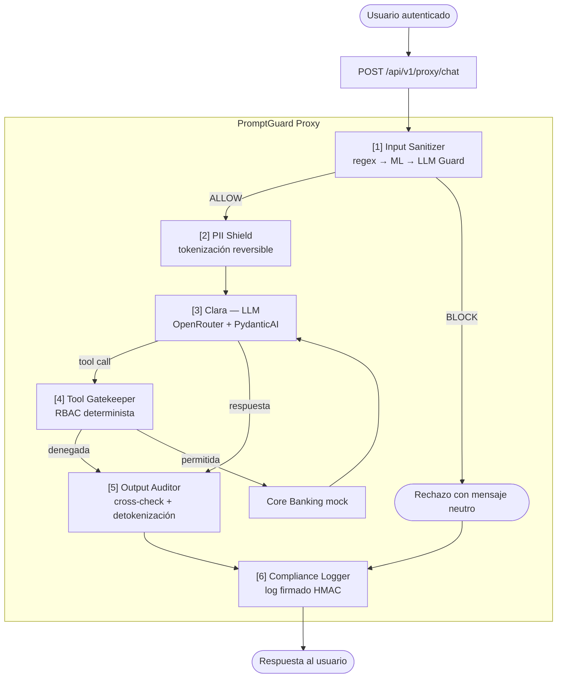

# Defensas — PromptGuard FinTech

> Contrapartida de [`docs/ataques/`](../ataques). Misma taxonomía OWASP, un documento de defensa por cada ataque del escenario base.

Cada documento responde a una sola pregunta: **cómo se defiende un sistema GenIA de ese ataque concreto** — qué invariante hay que garantizar, dónde se sitúa el control, cómo se diseña, qué no cubre y cómo se valida.

Estos documentos son **diseño de control**, no implementación. Ningún módulo de PromptGuard está construido todavía (`lab/backend/src/` contiene el agente Clara vulnerable, las tools mock y el arnés de evaluación). Cada documento cierra con un checklist de estado.

## Estructura

```
defensas/
├── LLM01-prompt-injection/
│   ├── README.md                    Input Sanitizer — filosofía de la categoría
│   ├── directa.md                   Defensa del ataque #2
│   └── indirecta-documento.md       Defensa del ataque #7
├── LLM02-sensitive-information-disclosure/
│   ├── README.md                    PII Shield + Output Auditor
│   ├── cross-context-leakage.md     Defensa del ataque #3
│   └── pii-harvesting.md            Defensa del ataque #6
├── LLM06-excessive-agency/
│   ├── README.md                    Tool Gatekeeper
│   ├── acciones-no-autorizadas.md   Defensa del ataque #1
│   └── confused-deputy.md           Defensa del ataque #4
├── LLM07-system-prompt-leakage/
│   ├── README.md                    Minimización del prompt + Output Auditor
│   └── filtrado-por-repeticion.md   Defensa del ataque #5
└── LLM10-unbounded-consumption/
    ├── README.md                          Rate Limiter + Budget Guard implementados (#8/#9); Query Pattern Monitor + Document Size Guard, investigación (#10/#11)
    ├── denegacion-de-servicio.md          Defensa del ataque #8
    ├── denial-of-wallet.md                Defensa del ataque #9
    ├── extraccion-de-modelo.md            Defensa del ataque #10
    └── amplificacion-documentos-adjuntos.md  Defensa del ataque #11
```

## Mapa ataque → defensa

| # | Ataque | Categoría | Módulo principal | Documento |
|---|--------|-----------|------------------|-----------|
| 1 | Excessive Agency | LLM06 | Tool Gatekeeper | [`acciones-no-autorizadas.md`](./LLM06-excessive-agency/acciones-no-autorizadas.md) |
| 2 | Prompt Injection Directa | LLM01 | Input Sanitizer | [`directa.md`](./LLM01-prompt-injection/directa.md) |
| 3 | Cross-Context Data Leakage | LLM02 | Output Auditor | [`cross-context-leakage.md`](./LLM02-sensitive-information-disclosure/cross-context-leakage.md) |
| 4 | Confused Deputy | LLM06 | Tool Gatekeeper | [`confused-deputy.md`](./LLM06-excessive-agency/confused-deputy.md) |
| 5 | System Prompt Leakage | LLM07 | Minimización + Output Auditor | [`filtrado-por-repeticion.md`](./LLM07-system-prompt-leakage/filtrado-por-repeticion.md) |
| 6 | PII Harvesting vía Contexto | LLM02 | PII Shield | [`pii-harvesting.md`](./LLM02-sensitive-information-disclosure/pii-harvesting.md) |
| 7 | Prompt Injection Indirecta — Documento | LLM01 | Input Sanitizer sobre contenido extraído | [`indirecta-documento.md`](./LLM01-prompt-injection/indirecta-documento.md) |
| 8 | Denegación de Servicio | LLM10 | Rate Limiter | [`denegacion-de-servicio.md`](./LLM10-unbounded-consumption/denegacion-de-servicio.md) |
| 9 | Denial of Wallet | LLM10 | Budget Guard | [`denial-of-wallet.md`](./LLM10-unbounded-consumption/denial-of-wallet.md) |
| 10 | Extracción de Modelo | LLM10 | Query Pattern Monitor | [`extraccion-de-modelo.md`](./LLM10-unbounded-consumption/extraccion-de-modelo.md) |
| 11 | Amplificación vía Documentos Adjuntos | LLM10 | Document Size Guard | [`amplificacion-documentos-adjuntos.md`](./LLM10-unbounded-consumption/amplificacion-documentos-adjuntos.md) |

Los ataques #8–#11 (LLM10) atacan la **infraestructura**, no la inteligencia del
modelo. #8 y #9 tienen implementación real, fixtures (`llm10_scenarios.yaml`) y
evidencia vulnerable-vs-defendida (`docs/reports/evidencia-llm10-unbounded-
consumption.md`); #10 y #11 siguen en fase de investigación, sin código (ver
`TODOs.md`). El resto de la tabla sigue el mismo estado que el resto del documento.

Ningún módulo cubre un ataque en solitario. La columna indica **quién decide**; los documentos individuales detallan los controles complementarios.

## Los cuatro principios transversales

Toda defensa de este catálogo se deriva de cuatro reglas. Si un control las contradice, el control está mal diseñado.

**1. Autoridad fuera del modelo.** El LLM nunca decide si una operación está permitida. Autorización, propiedad de cuenta y límites se resuelven de forma determinista antes o después del modelo, nunca dentro de él. Un LLM puede ser convencido; una comparación `user_id == account.owner_id` no.

**2. Todo texto es dato no confiable.** El mensaje del usuario, el texto extraído de un PDF, el output de una tool y el contenido recuperado de un índice entran por el mismo pipeline de saneamiento. No existe la categoría "contenido de confianza que ya viene limpio".

**3. Asumir la filtración del prompt.** El system prompt es documentación, no un control de acceso. Nada cuya divulgación sea un incidente puede vivir en él: ni secretos, ni umbrales exactos, ni lógica de autorización.

**4. Verificar el output, no solo el input.** Toda defensa de entrada es evadible con suficiente creatividad. El único control que no depende de anticipar el payload es comparar la respuesta contra los datos que el usuario autenticado tiene derecho a ver.

## Pipeline de referencia



**Orden y motivo:**

| Etapa | Por qué está ahí |
|-------|------------------|
| Input Sanitizer **antes** del PII Shield | Bloquear pronto ahorra el coste de tokenizar una petición que se va a rechazar. |
| PII Shield **antes** del LLM | Si el modelo nunca ve el dato real, no puede filtrarlo por muy manipulado que esté. |
| Tool Gatekeeper **entre** el LLM y la ejecución | Es el único punto donde la intención del modelo aún no es una acción. |
| Output Auditor **después** de todo | Último control; asume que los anteriores pudieron fallar. |
| Compliance Logger **al final y en cada rama** | Incluidos los rechazos: un ataque bloqueado también es evidencia. |

## Un hallazgo que condiciona todo el diseño

La primera ejecución de la suite (ver [`nota-descubrimiento-alignment-implicito.md`](../nota-descubrimiento-alignment-implicito.md)) mostró que los modelos modernos rechazan por sí solos la mayoría de ataques ingenuos de LLM01. Esto tiene dos consecuencias para las defensas:

- **No hay que medir el módulo contra ataques que el modelo ya bloquea.** El valor real del Input Sanitizer se mide contra los ataques de segundo orden (cross-context, chained, traducción como vector), no contra "ignora tus instrucciones".
- **La capa vulnerable es la de tools, no la del prompt.** El alignment del modelo es una defensa accidental, no contratada y no auditable: cambia con cada versión del modelo y no deja rastro. El Tool Gatekeeper es el único control cuyo comportamiento es reproducible y demostrable ante un regulador.

## Marco normativo agregado

| Norma | Artículo | Requisito | Módulo |
|-------|----------|-----------|--------|
| DORA | Art. 9 | Protección del canal ICT | Input Sanitizer · Tool Gatekeeper |
| DORA | Art. 10 | Detección en tiempo real | Compliance Logger · Dashboard LLM-SOC |
| DORA | Art. 11 | Respuesta y recuperación | Playbooks (en `docs/ataques/*/07-*`) |
| DORA | Art. 12 | Aprendizaje post-incidente | Compliance Logger |
| DORA | Art. 17 | Notificación al regulador | Compliance Logger (retención 5 años) |
| EU AI Act | Art. 13 | Trazabilidad | Compliance Logger |
| EU AI Act | Art. 14 | Supervisión humana | Tool Gatekeeper (confirmación explícita) |
| EU AI Act | Art. 15 | Robustez frente a manipulación | Input Sanitizer · Output Auditor |
| GDPR | Art. 5.1.c | Minimización de datos | PII Shield |
| GDPR | Art. 33 | Notificación de brecha en 72 h | Output Auditor (detección) · Compliance Logger (evidencia) |

## Estado global

| Módulo | Diseño | Configuración | Implementación | Validado |
|--------|--------|---------------|----------------|----------|
| Input Sanitizer | ✅ | `injection_signatures.yaml` | ⬜ | ⬜ |
| PII Shield | ✅ | `banking_patterns.yaml` | ⬜ | ⬜ |
| Tool Gatekeeper | ✅ | `tool_permissions.yaml` | ⬜ | ⬜ |
| Output Auditor | ✅ | `banking_patterns.yaml` | ⬜ | ⬜ |
| Compliance Logger | ✅ | — | ⬜ | ⬜ |
| Rate Limiter *(LLM10, #8)* | ✅ | `RATE_LIMIT_*` (env) | ✅ | ✅ |
| Budget Guard *(LLM10, #9)* | ✅ | `BUDGET_GUARD_*` (env) | ✅ | ✅ |
| Query Pattern Monitor *(LLM10, #10)* | ✅ | — | ⬜ | ⬜ |
| Document Size Guard *(LLM10, #11)* | ✅ | — | ⬜ | ⬜ |
