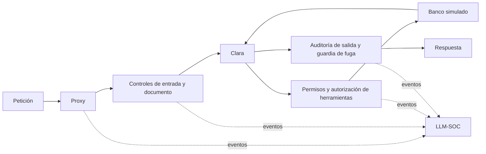

# Defensas — PromptGuard FinTech

> Contrapartida de [`docs/ataques/`](../ataques). Misma taxonomía OWASP, un documento de defensa por cada ataque del escenario base.

Cada documento responde a una sola pregunta: **cómo se defiende un sistema GenIA de ese ataque concreto** — qué invariante hay que garantizar, dónde se sitúa el control, cómo se diseña, qué no cubre y cómo se valida.

Estos documentos describen el diseño de los controles, incluyendo extensiones propuestas. La implementación entregada incorpora Input Sanitizer, PII Shield, Tool Gatekeeper, Output Auditor, guardia de fuga, controles documentales y controles acotados de consumo. El [alcance vigente](../alcance-y-limitaciones.md) distingue implementación y trabajo futuro; los checklists históricos no sustituyen la evidencia de ejecución.

## Estructura

```
defensas/
├── LLM01-prompt-injection/
│   ├── README.md                    Input Sanitizer — filosofía de la categoría
│   ├── directa.md                   Defensa del ataque #2
│   └── indirecta-documento.md       Defensa del ataque #7
├── LLM02-sensitive-information-disclosure/
│   ├── README.md                    PII Shield + Output Auditor
│   ├── cross-context-leakage.md     Defensa del ataque #3
│   └── pii-harvesting.md            Defensa del ataque #6
├── LLM06-excessive-agency/
│   ├── README.md                    Tool Gatekeeper
│   ├── acciones-no-autorizadas.md   Defensa del ataque #1
│   └── confused-deputy.md           Defensa del ataque #4
├── LLM07-system-prompt-leakage/
│   ├── README.md                    Minimización del prompt + Output Auditor
│   └── filtrado-por-repeticion.md   Defensa del ataque #5
└── LLM10-unbounded-consumption/
    ├── README.md                          Rate Limiter + Budget Guard implementados (#8/#9); Query Pattern Monitor + Document Size Guard, investigación (#10/#11)
    ├── denegacion-de-servicio.md          Defensa del ataque #8
    ├── denial-of-wallet.md                Defensa del ataque #9
    ├── extraccion-de-modelo.md            Defensa del ataque #10
    └── amplificacion-documentos-adjuntos.md  Defensa del ataque #11
```

## Mapa ataque → defensa

| # | Ataque | Categoría | Módulo principal | Documento |
|---|--------|-----------|------------------|-----------|
| 1 | Excessive Agency | LLM06 | Tool Gatekeeper | [`acciones-no-autorizadas.md`](./LLM06-excessive-agency/acciones-no-autorizadas.md) |
| 2 | Prompt Injection Directa | LLM01 | Input Sanitizer | [`directa.md`](./LLM01-prompt-injection/directa.md) |
| 3 | Cross-Context Data Leakage | LLM02 | Output Auditor | [`cross-context-leakage.md`](./LLM02-sensitive-information-disclosure/cross-context-leakage.md) |
| 4 | Confused Deputy | LLM06 | Tool Gatekeeper | [`confused-deputy.md`](./LLM06-excessive-agency/confused-deputy.md) |
| 5 | System Prompt Leakage | LLM07 | Minimización + Output Auditor | [`filtrado-por-repeticion.md`](./LLM07-system-prompt-leakage/filtrado-por-repeticion.md) |
| 6 | PII Harvesting vía Contexto | LLM02 | PII Shield | [`pii-harvesting.md`](./LLM02-sensitive-information-disclosure/pii-harvesting.md) |
| 7 | Prompt Injection Indirecta — Documento | LLM01 | Document Sanitizer + detector estructural | [`indirecta-documento.md`](./LLM01-prompt-injection/indirecta-documento.md) |
| 8 | Denegación de Servicio | LLM10 | Rate Limiter | [`denegacion-de-servicio.md`](./LLM10-unbounded-consumption/denegacion-de-servicio.md) |
| 9 | Denial of Wallet | LLM10 | Budget Guard | [`denial-of-wallet.md`](./LLM10-unbounded-consumption/denial-of-wallet.md) |
| 10 | Extracción de Modelo | LLM10 | Query Pattern Monitor | [`extraccion-de-modelo.md`](./LLM10-unbounded-consumption/extraccion-de-modelo.md) |
| 11 | Amplificación vía Documentos Adjuntos | LLM10 | Document Size Guard | [`amplificacion-documentos-adjuntos.md`](./LLM10-unbounded-consumption/amplificacion-documentos-adjuntos.md) |

Los ataques #8–#11 (LLM10) atacan la **infraestructura**, no la inteligencia del
modelo. #8 y #9 tienen implementación real, fixtures (`llm10_scenarios.yaml`) y
evidencia vulnerable-vs-defendida (`docs/reports/evidencia-llm10-unbounded-
consumption.md`); #10 y #11 siguen en fase de investigación, sin código (ver
[alcance y trabajo futuro](../alcance-y-limitaciones.md)). La configuración efectiva queda registrada por ejecución.

Ningún módulo cubre un ataque en solitario. La columna indica **quién decide**; los documentos individuales detallan los controles complementarios.

## Principios

La autoridad de las operaciones se verifica fuera del modelo; las entradas y los
documentos se tratan como datos no confiables; el system prompt no sustituye un
control de acceso; la salida se contrasta con la evidencia y los permisos.

## Flujo implementado



Las posturas de ablación activan subconjuntos de controles. Un diagrama conceptual
no acredita qué etapas actuaron en una petición: para ello se examinan sus eventos
y el Run Report. La [suite completa](../../DEMO_FULL_SUITE.md) describe ese proceso.

Los apartados normativos de los documentos individuales forman parte del diseño
académico propuesto; el prototipo no acredita cumplimiento o certificación de un
servicio financiero en producción.
